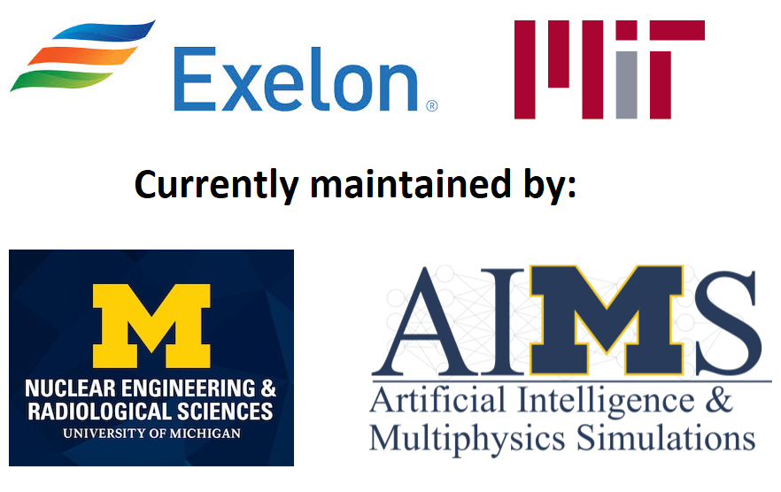

<!---
[](https://travis-ci.com/hill-a/stable-baselines) [](https://stable-baselines.readthedocs.io/en/master/?badge=master) [](https://www.codacy.com/app/baselines_janitors/stable-baselines?utm_source=github.com&amp;utm_medium=referral&amp;utm_content=hill-a/stable-baselines&amp;utm_campaign=Badge_Grade) [](https://www.codacy.com/app/baselines_janitors/stable-baselines?utm_source=github.com&utm_medium=referral&utm_content=hill-a/stable-baselines&utm_campaign=Badge_Coverage)
--->

# NEORL

NEORL (**N**euro**E**volution **O**ptimization with **R**einforcement **L**earning) is a set of implementations of hybrid algorithms combining neural networks and evolutionary computation based on a wide range of machine learning and evolutionary intelligence architectures. NEORL aims to solve large-scale optimization problems relevant to operation & optimization research, engineering, business, and other disciplines. 

NEORL can be used for multidisciplinary applications for research, industrial, academic, and/or teaching purposes. NEORL can be used as a standalone platform or an additional benchmarking tool to supplement or validate other optimization packages. Our objective when we built NEORL is to give the user a simple and easy-to-use framework with an access to a wide range of algorithms, covering both standalone and hybrid algorithms in evolutionary, swarm, supervised learning, deep learning, and reinforcement learning. We hope NEORL will allow beginners to enjoy more advanced optimization and algorithms, without being involved in too many theoretical/implementation details, and give experts an opportunity to solve large-scale optimization problems.

## Documentation

Documentation is available online: [https://neorl.readthedocs.io/en/latest/index.html](https://neorl.readthedocs.io/en/latest/index.html)

## Copyright



This repository and its content are copyright of [Exelon Corporation](https://www.exeloncorp.com/) © in collaboration with [MIT](https://web.mit.edu/nse/) Nuclear Science and Engineering 2021. All rights reserved.

You can read the first successful and the baseline application of NEORL for nuclear fuel optimization in this [News Article](https://news.mit.edu/2020/want-cheaper-nuclear-energy-turn-design-process-game-1217).

## Basic Features

| **Features**                             | **NEORL**                         
| -----------------------------------------| ----------------------------------- 
| Reinforcement Learning (standalone)      | :heavy_check_mark:                |
| Evolutionary Computation (standalone)    | :heavy_check_mark:                |
| Hybrid Neuroevolution                    | :heavy_check_mark:                |
| Supervised Learning                      | :heavy_check_mark:                |
| Parallel processing                      | :heavy_check_mark:                |
| Combinatorial/Discrete Optimization      | :heavy_check_mark:                |
| Continuous Optimization                  | :heavy_check_mark:                |
| Mixed Discrete/Continuous Optimization   | :heavy_check_mark:                |
| Hyperparameter Tuning                    | :heavy_check_mark:                |
| Ipython / Notebook friendly              | :heavy_check_mark:                |
| Detailed Documentation                   | :heavy_check_mark:                |
| Advanced logging                         | :heavy_check_mark:                |
| Optimization Benchmarks                  | :heavy_check_mark:                |

### Knowledge Prerequisites

**Note: despite the simplicity of NEORL usage, most algorithms, especially the neuro-based, need some basic knowledge about the optimization research and neural networks in supervised and reinforcement learning**. Using NEORL without sufficient knowledge may lead to undesirable results due to the poor selection of algorithm hyperparameters. You should not utilize this package without basic knowledge in machine learning and optimization. 

## Safe Installation (Strongly Recommended)

Safe installation will setup NEORL in a separate virtual environment with its own dependencies. This eliminates any conflict with your existing package versions (e.g. numpy, Tensorflow).

To install on Linux, here are the steps:

https://neorl.readthedocs.io/en/latest/guide/detinstall.html

For Windows, the steps can be found here:

https://neorl.readthedocs.io/en/latest/guide/detinstall.html#windows-10

## Quick Installation

For both Ubuntu and Windows, you can install NEORL via pip

```
pip install neorl
```

However, we strongly recommend following safe installation steps to avoid any conflict between NEORL dependencies (e.g. TensorFlow) and your current Python packages. 

## Testing NEORL Installation

Upon successful installation, NEORL offers a robust unit test package to test all algorithms, you can run the tests via terminal using 

```
neorl --test
```

All unit tests in NEORL can be executed using pytest runner. If pytest is not installed, please use
```
pip install pytest pytest-cov
```
before running the tests. 

## Example

Here is a quick example of how to use NEORL to minimize a 5-D sphere function:
```python
#---------------------------------
# Import packages
#---------------------------------
import numpy as np
import matplotlib.pyplot as plt
from neorl import DE, XNES

#---------------------------------
# Fitness
#---------------------------------
#Define the fitness function
def FIT(individual):
    """Sphere test objective function.
            F(x) = sum_{i=1}^d xi^2
            d=1,2,3,...
            Range: [-100,100]
            Minima: 0
    """

    return sum(x**2 for x in individual)

#---------------------------------
# Parameter Space
#---------------------------------
#Setup the parameter space (d=5)
nx=5
BOUNDS={}
for i in range(1,nx+1):
    BOUNDS['x'+str(i)]=['float', -100, 100]

#---------------------------------
# DE
#---------------------------------
de=DE(mode='min', bounds=BOUNDS, fit=FIT, npop=50, CR=0.5, F=0.7, ncores=1, seed=1)
x_best, y_best, de_hist=de.evolute(ngen=120, verbose=0)
print('---DE Results---', )
print('x:', x_best)
print('y:', y_best)

#---------------------------------
# NES
#---------------------------------
x0=[-50]*len(BOUNDS)
amat = np.eye(nx)
xnes=XNES(mode='min', bounds=BOUNDS, fit=FIT, npop=50, eta_mu=0.9,
          eta_sigma=0.5, adapt_sampling=True, seed=1)
x_best, y_best, nes_hist=xnes.evolute(120, x0=x0, verbose=0)
print('---XNES Results---', )
print('x:', x_best)
print('y:', y_best)


#---------------------------------
# Plot
#---------------------------------
#Plot fitness for both methods
plt.figure()
plt.plot(np.array(de_hist), label='DE')
plt.plot(np.array(nes_hist['fitness']), label='NES')
plt.xlabel('Generation')
plt.ylabel('Fitness')
plt.legend()
plt.show()
```


<!---
## Enjoy NEORL with Colab Notebooks !

All the following examples can be executed online using Google colab notebooks:
- [Sphere](https://github.com/araffin/rl-tutorial-jnrr19)
- [Pressure Vessel](https://github.com/Stable-Baselines-Team/rl-colab-notebooks)
- [Welded Beam](https://colab.research.google.com/github/Stable-Baselines-Team/rl-colab-notebooks/blob/master/stable_baselines_getting_started.ipynb)
--->

## Implemented Algorithms

NEORL offers a wide range of algorithms, where some algorithms could be used with a specific parameter space.

| **Algorithm**       | **Discrete Space** | **Continuous Space**| **Mixed Space**    | **Multiprocessing**|   
| ------------------- | ------------------ | ------------------  | ------------------ | ------------------ |
| ACER                | :heavy_check_mark: | :x:                 | :x:                | :heavy_check_mark: |
| ACKTR               | :heavy_check_mark: | :heavy_check_mark:  | :heavy_check_mark: | :heavy_check_mark: |
| A2C                 | :heavy_check_mark: | :heavy_check_mark:  | :heavy_check_mark: | :heavy_check_mark: |
| PPO                 | :heavy_check_mark: | :heavy_check_mark:  | :heavy_check_mark: | :heavy_check_mark: |
| DQN                 | :heavy_check_mark: | :x:                 | :x:                | :x:                |
| ES                  | :heavy_check_mark: | :heavy_check_mark:  | :heavy_check_mark: | :heavy_check_mark: |
| PSO                 | :heavy_check_mark: | :heavy_check_mark:  | :heavy_check_mark: | :heavy_check_mark: |
| DE                  | :heavy_check_mark: | :heavy_check_mark:  | :heavy_check_mark: | :heavy_check_mark: |
| XNES                | :x:                | :heavy_check_mark:  | :x:                | :heavy_check_mark: |
| GWO                 | :heavy_check_mark: | :heavy_check_mark:  | :heavy_check_mark: | :heavy_check_mark: |
| PESA                | :heavy_check_mark: | :heavy_check_mark:  | :heavy_check_mark: | :heavy_check_mark: |
| PESA2               | :heavy_check_mark: | :heavy_check_mark:  | :heavy_check_mark: | :heavy_check_mark: |
| RNEAT               | :x:                | :heavy_check_mark:  | :x:                | :heavy_check_mark: |
| FNEAT               | :x:                | :heavy_check_mark:  | :x:                | :heavy_check_mark: |
| SA                  | :heavy_check_mark: | :heavy_check_mark:  | :heavy_check_mark: | :heavy_check_mark: |
| SSA                 | :heavy_check_mark: | :heavy_check_mark:  | :heavy_check_mark: | :heavy_check_mark: |
| WOA                 | :heavy_check_mark: | :heavy_check_mark:  | :heavy_check_mark: | :heavy_check_mark: |
| JAYA                | :heavy_check_mark: | :heavy_check_mark:  | :heavy_check_mark: | :heavy_check_mark: |
| MFO                 | :heavy_check_mark: | :heavy_check_mark:  | :heavy_check_mark: | :heavy_check_mark: |
| HHO                 | :heavy_check_mark: | :heavy_check_mark:  | :heavy_check_mark: | :heavy_check_mark: |
| BAT                 | :heavy_check_mark: | :heavy_check_mark:  | :heavy_check_mark: | :heavy_check_mark: |
| PPO-ES              | :heavy_check_mark: | :heavy_check_mark:  | :heavy_check_mark: | :heavy_check_mark: |
| ACKTR-DE            | :heavy_check_mark: | :heavy_check_mark:  | :heavy_check_mark: | :heavy_check_mark: |
| ACO                 | :x:                | :heavy_check_mark:  | :x:                | :heavy_check_mark: |
| NGA                 | :x:                | :heavy_check_mark:  | :x:                | :x:                |
| NHHO                | :heavy_check_mark: | :heavy_check_mark:  | :heavy_check_mark: | :heavy_check_mark: |
| CS                  | :heavy_check_mark: | :heavy_check_mark:  | :heavy_check_mark: | :heavy_check_mark: |
| TS                  | :heavy_check_mark: | :heavy_check_mark:  | :x:                | :x:                |

## Major Founding Papers of NEORL

1- Radaideh, M. I., Wolverton, I., Joseph, J., Tusar, J. J., Otgonbaatar, U., Roy, N., Forget, B., Shirvan, K. (2021). Physics-informed reinforcement learning optimization of nuclear assembly design. *Nuclear Engineering and Design*, **372**, p. 110966.

2- Radaideh, M. I., Shirvan, K. (2021). Rule-based reinforcement learning methodology to inform evolutionary algorithms for constrained optimization of engineering applications. *Knowledge-Based Systems*, **217**, p. 106836.

3- Radaideh, M. I., Forget, B., & Shirvan, K. (2021). Large-scale design optimisation of boiling water reactor bundles with neuroevolution. *Annals of Nuclear Energy*, **160**, p. 108355.

## Citing the Project

To cite this repository in publications:

```
@misc{neorl,
  author = {Radaideh, Majdi I. and Du, Katelin and Seurin, Paul and Seyler, Devin and Gu, Xubo and Wang, Haijia and Shirvan, Koroush},
  title = {NEORL},
  year = {2021},
  publisher = {GitHub},
  journal = {GitHub repository},
  howpublished = {\url{https://github.com/mradaideh/neorl}},
}
```

## Maintainers

See our team here [Contributors](https://neorl.readthedocs.io/en/latest/misc/contrib.html). We are welcoming new contributors to the project. 

**Important Note**: We do not do technical support and we do not answer personal questions via email.

## Acknowledgments

NEORL was established in MIT back to 2020 with feedback, validation, and usage of different colleagues: Issac Wolverton (MIT Quest for Intelligence), Joshua Joseph (MIT Quest for Intelligence), Benoit Forget (MIT Nuclear Science and Engineering), Ugi Otgonbaatar (Exelon Corporation), and James Tusar (Exelon Corporation). We also thank our fellows at [Stable Baselines](https://github.com/hill-a/stable-baselines), [DEAP](https://github.com/DEAP/deap), and [EvoloPy](https://github.com/7ossam81/EvoloPy) for sharing their implementation, which inspired us to leverage our optimization classes. 