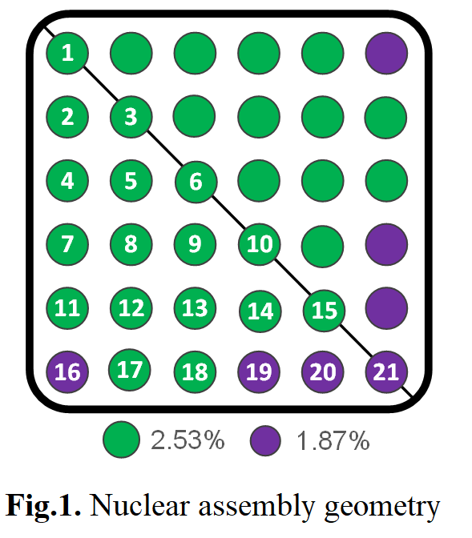
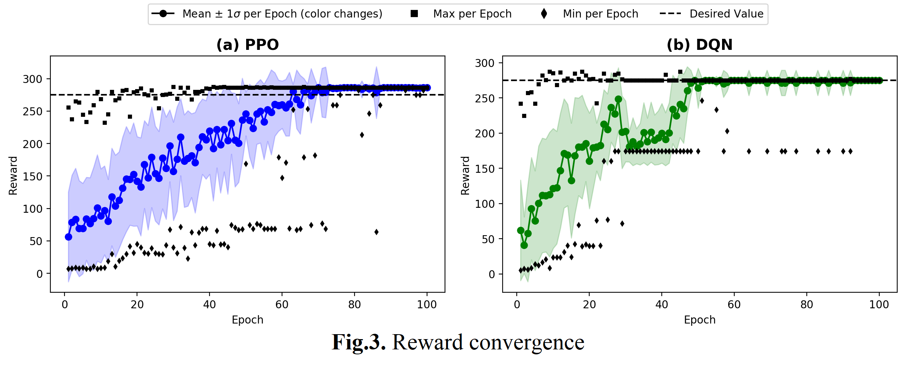
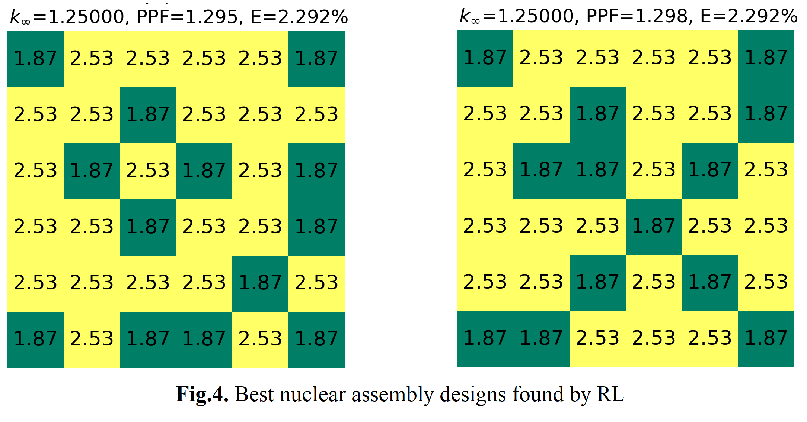

.. _ex1:

Example 1
============

Example of solving a combinatorial optimisation problem using NEORL in a small nuclear fuel assembly with reinforcement learning.

Summary
--------------------

-  Algorithms: DQN, PPO
-  Type: Discrete/Combinatorial, Multi-objective, Constrained
-  Field: Nuclear Engineering
 

Problem Description
--------------------

The system optimized in this example is the nuclear fuel assembly; a top view of a boiling water reactor assembly design is sketched in Fig.1. Assembly combinatorial optimization is seen as a permutation with repetition problem with cost proportional to :math:`O(m^n)`, where :math:`m` is the number of fuel types (i.e., choices) to pick from, while :math:`n` is the number of fuel rod locations to optimize (i.e., number of times to choose). The fuel material consists of Uranium Oxide (:math:`UO_2`). The 6x6 assembly in Fig.1 features two types of :math:`UO_2` fuel with 1.87\% and 2.53\% U-235 enrichment. The assembly geometry is sketched in Fig.1, where the numbered rods on and below the diagonal line are included in the optimization process. So if every position of the 21 has two possible choices of fuel: 1.87\% or 2.53\%, the exact number of possible permutations (i.e., full size of the search space) can be estimated as :math:`2^{21}=2,097,152`. The multi-objective function to be minimized can be expressed as

.. math::

	\min \limits_{\vec{x}} \ F(\vec{x}) =  \bigg|\frac{1.25-k_\infty}{1.25}\bigg| + w_p \bigg|\frac{1.35-PPF}{1.35}\bigg| + \bigg|\frac{2.3 - E}{2.3}\bigg|,

where :math:`w_p= 1` when :math:`PPF > 1.35` and :math:`w_p= 0` otherwise. The reason is that PPF is perceived as a threshold safety parameter to be maintained below a specific value (e.g., 1.35). Once this condition is satisfied, optimizing PPF is no longer needed. Accordingly, the reward to be maximized in this example is nothing but the reciprocal of the objective function

.. math::

    \max \limits_{\vec{x}} \ Reward =  \frac{1}{F(\vec{x})},

For this case study, the action space is a ``Discrete`` variable of size two: 1.87\% and 2.53\%, which are the :math:`UO_2` enrichment. The state space is a ``Box`` of size :math:`21 \times 2`, while the ``reward`` is a scalar value.

.. _fig-ex1-geom:

NEORL script
--------------------

Results
--------------------

.. _fig-ex1-objs:

The convergence of the three individual objectives (:math:`k_\infty` , :math:`E`, :math:`PPF`) are shown below

.. image:: ../images/ex1-objs.png
   :scale: 30%
   :alt: alternate text
   :align: center
  
The convergence of the total reward is shown below for both DQN and PPO
  

Lastly, plots of the best nuclear assembly patterns based on Fig.1 are shown below as found by the two RL algorithms. These two assembly designs belong to the known global optima group (the best possible patterns to find) 

   
   
