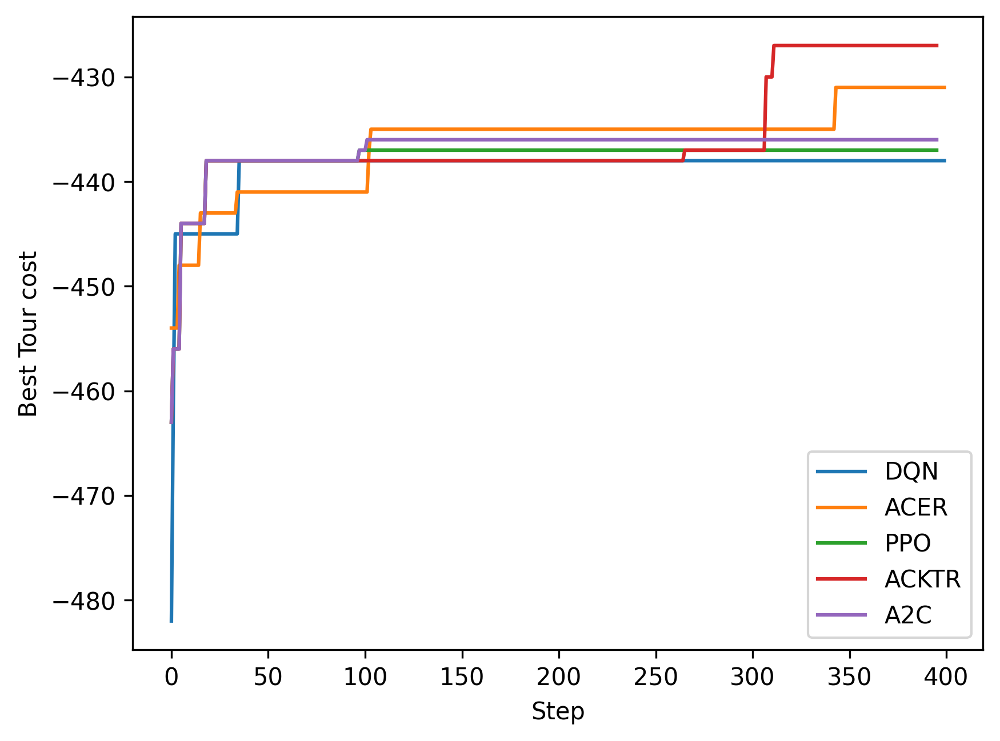
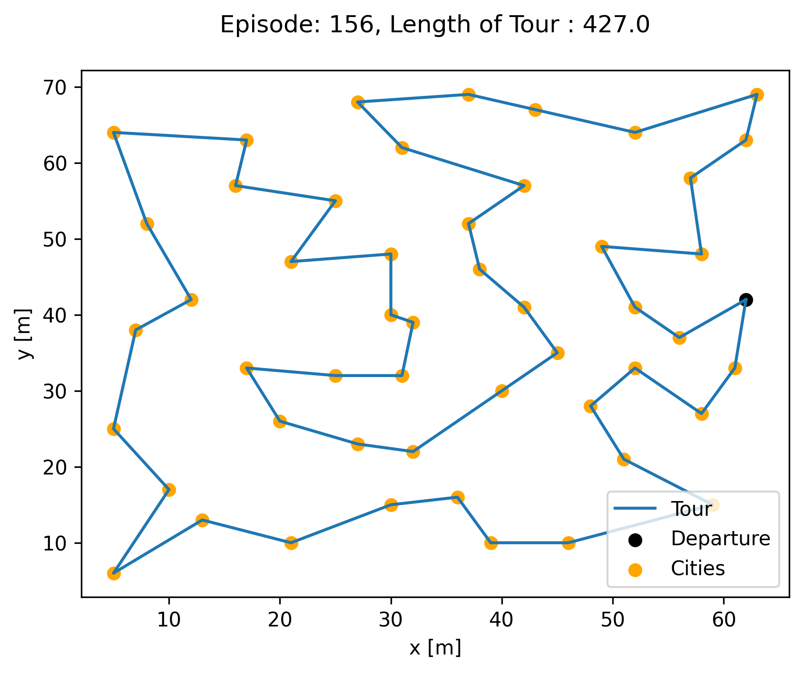

.. _ex1:

Example 1: Traveling Salesman Problem
=======================================

Example of solving the classical discrete optimization problem "Traveling Salesman Problem" (TSP) using NEORL with state-of-the-art reinforcement learning algorithms to demonstrate compatibility with discrete space.

Summary
--------------------

- Algorithm: PPO, A2C, ACKTR, DQN, ACER
- Type: Discrete/Combinatorial, Single Objective, Constrained
- Field: Computational Mathematics
 

Problem Description
--------------------

The Traveling Salesman Problem (TSP) is a well known problem in the discrete optimization community and find applications well beyond computational mathematics: genetics, chemistry,telecommunications, and nuclear reactor optimization. Based on the spatial distribution of cities representing the vertices on a Graph :math:`G`, the objective is to minimize the length of a tour :math:`\mathcal{T}` defined as a cycle on the graph that visits all vertices (cities) only once and circle back to the departure state. An example is given in the figure below:

.. image:: ../images/tsp.png
   :scale: 80%
   :alt: alternate text
   :align: center

Formally,  the graph is described by :math:`G = (V,A)`, where :math:`V` is the collection of :math:`N` vertices, :math:`A = \{(i,j): i,j \in V\}` is the set of edges with cost :math:`c: A -> \mathbb{R}`, :math:`c: (i,j) -> c_{i,j}`,  where :math:`c_{ij}` is the distance from node :math:`i` to node :math:`j`. Lastly, :math:`x_{ij}` are boolean variables such that :math:`x_{ij} = 1` if the edge :math:`(i,j)` is active. One formulation of the problem is (known as the "cutset" formulation):

.. math::

    &\max \quad - \Sigma_i \Sigma_j x_{ij}c_{ij} = f(\mathcal{T}) \\
    &s.t \quad \Sigma_i x_{ij} = 1 \quad  \forall i: (i,j) \in A\\
    & \Sigma_i x_{ji} = 1 \quad \forall i: (j,i) \in A\\
    & \Sigma_{i \in S, j \in V \backslash S}\quad x_{ij} \ge 2 \quad \forall S \subset V, S \notin \{\emptyset,V\}\\
    & x_{ij} \in \{0,1\}

where :math:`S` is a proper subset of the vertices :math:`V`, i.e. it is connected to one of the remaining nodes (translated through the third constraint) and :math:`\mathcal{T} = \{e_1,...,e_N\}` is a tour, where :math:`\forall i, e_i \in A`. The first two constraints indicate that every city must be visited at least once and be left to another city. The third constraint indicates that each subset of cities is connected to another subset, which prevents inner cycle to form within the tour.

NEORL script
--------------------

.. literalinclude :: ../scripts/ex1_tsp.py
   :language: python

Results
--------------------

A summary of the results is shown below for the case of **51 cities**. First, all five reinforcement learning algorithms are compared in terms of minimizing the tour length (notice the y-axis is multiplied by -1 to make it a maximization problem). The cost convergence shows that ACKTR is the best algorithm in this case. Therefore, we will limit the reported results to ACKTR.  

   
The best tour cost found by ACKTR is 427, which is really close to the optimal tour of 426. **ACKTR tour** is below
   

while here is the target **optimal** tour

.. image:: ../images/optimal_tour.png
   :scale: 25%
   :alt: alternate text
   :align: center
   
And here are the final results of all algorithms:

.. code-block:: python

	--------------- DQN results ---------------
	The best value of x found: ['36', '7', '8', '9', '10', '47', '41', '11', '43', '44', '45', '46', '48', '21', '50', '51', '12', '37', '42', '24', '17', '27', '25', '14', '30', '31', '32', '33', '34', '35', '38', '39', '40', '49', '4', '15', '2', '1', '3', '5', '23', '20', '26', '19', '13', '22', '16', '18', '6', '28', '29']
	The best value of y found: -438
	--------------- ACER results ---------------
	The best value of x found: ['35', '3', '12', '44', '23', '49', '19', '26', '18', '32', '33', '45', '21', '28', '15', '30', '38', '9', '46', '17', '42', '14', '37', '48', '39', '47', '1', '41', '43', '25', '11', '31', '20', '34', '16', '5', '24', '7', '51', '50', '27', '4', '2', '6', '29', '36', '10', '13', '8', '40', '22']
	The best value of y found: -431.0
	--------------- PPO results ---------------
	The best value of x found: ['51', '8', '27', '42', '35', '11', '14', '20', '17', '29', '40', '38', '49', '50', '41', '34', '5', '36', '21', '13', '45', '37', '26', '1', '19', '46', '22', '28', '2', '43', '30', '31', '3', '47', '15', '24', '4', '7', '9', '10', '48', '12', '25', '18', '32', '33', '44', '16', '23', '39', '6']
	The best value of y found: -437.0
	--------------- ACKTR results ---------------
	The best value of x found: ['50', '37', '45', '49', '35', '42', '40', '4', '38', '25', '43', '1', '48', '16', '44', '13', '5', '28', '34', '39', '33', '12', '31', '24', '14', '22', '7', '27', '19', '18', '6', '46', '32', '8', '23', '2', '51', '15', '17', '11', '30', '29', '10', '26', '41', '47', '21', '9', '3', '36', '20']
	The best value of y found: -427.0
	--------------- A2C results ---------------
	The best value of x found: ['47', '5', '14', '39', '34', '13', '35', '41', '28', '33', '46', '24', '19', '4', '22', '8', '43', '38', '1', '44', '23', '32', '15', '16', '48', '45', '42', '10', '12', '36', '27', '17', '9', '21', '7', '30', '25', '26', '37', '29', '18', '31', '2', '11', '20', '6', '49', '40', '51', '50', '3']
	The best value of y found: -436.0
   
