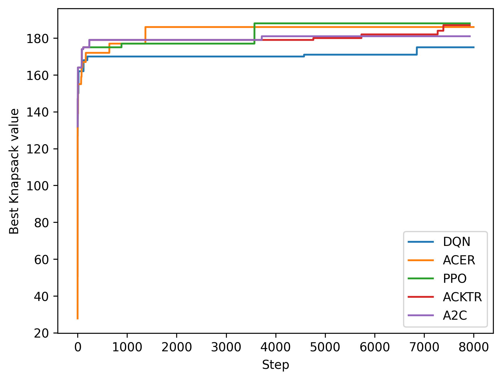

.. _ex10:

Example 10: Knapsack Problem
=======================================

Example of solving the classical discrete optimization problem "Knapsack Problem" (KP) using NEORL with state-of-the-art reinforcement learning algorithms to demonstrate compatibility with discrete space.

Summary
--------------------

- Algorithm: PPO,A2C, ACKTR, DQN, ACER
- Type: Discrete/Combinatorial, Single Objective, Constrained
- Field: Computational mathematics

Problem Description
--------------------

The Knapsack Problem (KP) is another combinatorial problem that has been studied for decades. It often arises in resource allocation problem, machine scheduling, and asset optimization for instance. It consists in maximizing the value of a set of items placed in a bag limited by the weight capacity :math:`W` of the bag. The figure below illustrates the problem. The maximum weight that the bag can contain is 15kg. The optimum set of items is obtained by taking all of them instead of the 12 kg one. A good heuristic is to choose the item with the lowest weight-to-value ratio.

.. image:: ../images/kp.png
   :scale: 30%
   :alt: alternate text
   :align: center

Formally, with :math:`i = 1,...,n` items, each characterized by their values and weights :math:`(\nu_i,w_i)`, the problem can be formulated as:

.. math::

    &\max \sum_{i=1}^n\nu_ix_i \\
    &s.t. \quad \sum_{i=1}^nw_ix_i \le W \\
    &x_i \in \{0,1\}

where :math:`x_i=1` if the item :math:`i` is in the bag, otherwise :math:`x_i=0`. This is called the 0-1 Knapsack Problem. The constraint characterizes the fact that the capacity of the bag is limited by :math:`W`, hence the sum of the weights :math:`\sum_{i=1}^nw_ix_i` of the items should not exceed :math:`W`.

NEORL script
--------------------

.. literalinclude :: ../scripts/ex10_kp.py
   :language: python
   
Results
--------------------

A summary of the results is shown below for the case of **50 items/objects**. First, all five reinforcement algorithms are compared in terms of maximizing the sum of item weights. The fitness convergence shows that PPO and ACKTR are the best algorithms in this case, with PPO slightly achieved a better fitness. Therefore, we will limit the reported results to PPO.  

   
The maximum value of the Knapsack tour cost found by PPO is 188, which is fairly close to the optimal sum of item values of 204. The **PPO Knapsack** is below
   
.. image:: ../images/best_kp.png
   :scale: 25%
   :alt: alternate text
   :align: center

while here is the target **optimal** Knapsack

.. image:: ../images/optimal_kp.png
   :scale: 25%
   :alt: alternate text
   :align: center
   
And here are the final results of all algorithms:

.. code-block:: python

	--------------- DQN results ---------------
	The best value of x found: ['7', '8', '9', '10', '11', '12', '13', '14', '15', '16', '17', '18', '19', '20', '21', '22', '23', '24', '25', '26', '27', '28', '29', '33', '45', '36', '48', '35', '6', '37', '4', '30', '41']
	The best value of y found: 175.0
	--------------- ACER results ---------------
	The best value of x found: ['41', '36', '10', '2', '6', '22', '13', '7', '15', '48', '19', '8', '21', '17', '49', '3', '11', '4', '23', '26', '25', '1', '28', '50', '9', '20', '24', '33', '29', '32', '31', '14', '43', '27']
	The best value of y found: 186.0
	--------------- PPO results ---------------
	The best value of x found: ['11', '28', '12', '4', '30', '47', '33', '9', '17', '29', '49', '26', '41', '43', '6', '3', '45', '22', '35', '8', '48', '15', '36', '44', '23', '7', '32', '21', '34', '1', '25', '27', '19', '20', '14', '40']
	The best value of y found: 188.0
	--------------- ACKTR results ---------------
	The best value of x found: ['29', '12', '31', '4', '7', '36', '39', '24', '10', '40', '15', '22', '33', '48', '9', '19', '32', '45', '34', '14', '8', '25', '2', '11', '46', '28', '23', '3', '49',
	'26', '21', '35', '16', '38']
	The best value of y found: 187.0
	--------------- A2C results ---------------
	The best value of x found: ['16', '28', '15', '4', '32', '23', '20', '1', '43', '8', '36', '3', '35', '46', '2', '22', '21', '41', '18', '7', '24', '38', '40', '11', '12', '29', '44', '49', '48', '37', '33', '9']
	The best value of y found: 181.0
   
