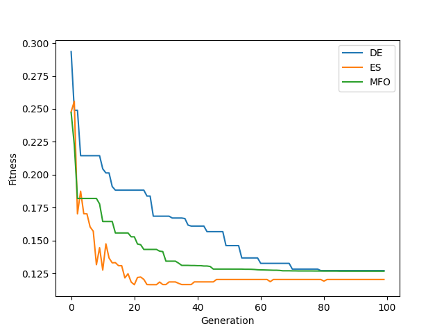

.. _ex11:

Example 11: Microreactor Control with Malfunction
=================================================

Example demonstrating NEORL used to find optimal control mechanism positions to acheive favorable operation of a nuclear microreactor.

Original paper: Price, D., Radaideh, M., Kochunas, B. Multiobjective optimization of nuclear microreactor control system operation with surrogate-based evoluationary algorithms. Nuclear Engineering and Design. (Under Review)

Summary
--------------------

- Algorithm: DE, ES, MFO
- Type: Multi Objective, Unconstrained
- Field: Nuclear Engineering
 

Problem Description
--------------------
The HOLOS-Quad reactor design is a high-temperature gas-cooled microreactor which has 8 cylindrical control drums for reactivity control. Each of the drums has a portion of their outer surface covered by absorbing material which, when rotated towards the body of the core, can absorb neutrons. The position of a drum will refer to its rotation angle from fully inserted. A view of the core design is given below:

<<awaiting approval to include picture>>

In this example, one of the 8 drums is immobilized and the positions of the remaining 7 drums need to be selected to satisfy three criteria:

1. Insert a target reactivity: In order for a nuclear reactor to effectively operate, the control system needs to adjust such that the core can have a criticality of 1.
2. Minimize the differences in quadrant powers: Nuclear reactors must maintain relatively even power distributions to effectively operate because the maximum reactor power is limited by the highest power region in the core. Even power distributions allow for higher power output while maintaining safe operation.
3. Minimize the travel distance of the farthest traveling drum: Control drums have a maximum rotation speed which dictates the amount of time required to a drum to a certain position. Therefore, minimizing the travel distance of the farthest traveling drum will minimize the time required to position all control drums.

These criteria must be expressed mathematically to create the objective functions. Due to the large computational cost associated with conventional calculation methods for core criticality and quadrant powers, surrogate models must be used. For the target reactivity objective, a method which uses a physics-based model augmented with a statistical model is used to predict the reactivity inserted from a particular control drum configuration. This model is described in detail in the paper below:

Price, D., Kinast, S., Barr, K., Kochunas, B., & Filippone, C. (2021), A perturbation-based hybrid methodology for control drum worth prediction applied to the HOLOS-Quad microreactor concept. Annals of Nuclear Energy. (In Press)

This model will be refered to as :math:`\rho(\vec{x})` where :math:`\vec{x}` is a vector of 7 control drum positions. Each component of :math:`\vec{x}` is bounded by -:math:`\pi` and :math:`\pi` radians. The objective function can then be written as:

.. math::
   \hat{f}_c(\vec{x}) = |\rho_{tgt} - \rho(\vec{x})|

where :math:`\rho_{tgt}` is the target reactivity. The :math:`c` subscript on :math:`\hat{f}` is used to show that this objective function corresponds to the criticality conditions of the core. The circumflex indicates that this objective is currently unscaled.

For the next objective, that is to minimize the differences in quadrant powers, a neural network is used to predict fractional quadrant powers for a particlar control drum configuration. More information on this neural network is given in the paper given at the top of this page as "Original Paper". If the power in each quadrant of the core can be represented by :math:`P` with some subscript indicating which of the four quadrants :math:`P` represents, the objective function can be given as:

.. math::
   \hat{f}_p(\vec{x}) = \sum_{i=1}^4 \left| \frac{P_i}{P_1 + P_2 + P_3 + P_4} - \frac{1}{4} \right|

Here, the :math:`p` subscript is included to indicate the objective function corresponding to the core quadrant powers.

The final objective is the simplest of the three, it is simply the maximum drum rotation angle present in :math:`\vec{x}`.

.. math::
   \hat{f}_d(\vec{x}) = \max \vec{x}

Now that the three objective functions have been defined, they can be scaled such that their outputs occupy similar scales. Although not strictly necessary, it makes the weight selection with the scalarization method considerably more straightforward. Separately for each of the three objectives, :math:`\hat{f}(\vec{x})` is transformed into :math:`f(\vec{x})` using the equation given below:

.. math::
   f(\vec{x}) = \frac{\hat{f}(\vec{x}) - \hat{f}_{min}}{\hat{f}_{max} - \hat{f}_{min}}

where :math:`\hat{f}_{max}` and :math:`\hat{f}_{min}` denote the maxima and minima of the objective being scaled. This can be obtained with a simple single objective optimization problem or it can be obtained using knowledge of the problem. Nevertheless, in this application, these extrema are given in the original paper.

Next, scalarization is performed. Scalarization is a method used to reduce a multi objective optimization problem into a single objective optimization problem by assigning weights to each objective and summing them together. Mathematically, this can be written as:

.. math::
   F(\vec{x}) = w_c f_c(\vec{x}) + w_p f_p(\vec{x}) + w_d f_d(\vec{x})

Here, :math:`F(\vec{x})` is the function that will be plugged into an optimizer and :math:`w` is used to indicate the weight assigned to each of the objective functions. Moreover, the selection of these weights is nontrivial and an important part of complex optimization analyses. For this application, :math:`w_c = 0.50, w_p = 0.40` and :math:`w_d = 0.10`. More discussion is given in the original paper on the selection of these weights. 

NEORL script
--------------------

.. literalinclude :: ../scripts/ex11_microreactor.py
   :language: python

Results
--------------------
A summary of the results for the different methods is shown below with the best :math:`\vec{x}` and :math:`F(\vec{x})`. All methods seem to reasonably seek minima.

.. code-block:: python

	------------------------ DE Summary --------------------------
	Best fitness (y) found: 0.12723682745792148
	Best individual (x) found: [3.113469132155524, 2.52205504536713, -1.940784552123703, 2.3264933610351117, -2.0539691214048084, 3.089626887713435, 1.4072560227038484]
	--------------------------------------------------------------
	------------------------ ES Summary --------------------------
	Best fitness (y) found: 0.11653471587218096
	Best individual (x) found: [3.141592653589793, 2.0878715421838763, 2.0334381504862433, 2.2178488588636247, -2.2914574224308626, 2.4524812539265213, 1.7243458084183882]
	--------------------------------------------------------------
	------------------------ MFO Summary --------------------------
	Best fitness (y) found: 0.12684771880454485
	Best individual (x) found: [3.14159265 3.14159265 1.29847427 1.85712596 3.14159265 2.77812329 1.89814577]
	--------------------------------------------------------------

The errors in the unscaled objectives can also be obtained:

.. code-block:: python

	print("MFO fc hat")
	print(hatfc(mfo_x))
	print("MFO fp hat")
	print(hatfp(mfo_x))
	print("MFO fd hat")
	print(hatfd(mfo_x))

.. code-block:: python

	MFO fc hat
	1.9822642943062574e-07
	MFO fp hat
	0.0023153573274612427
	MFO fd hat
	3.141592653589793

