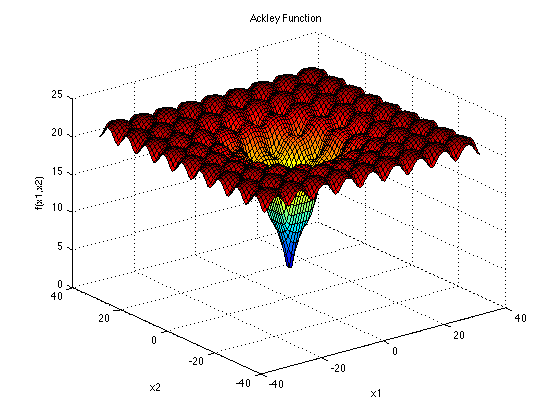
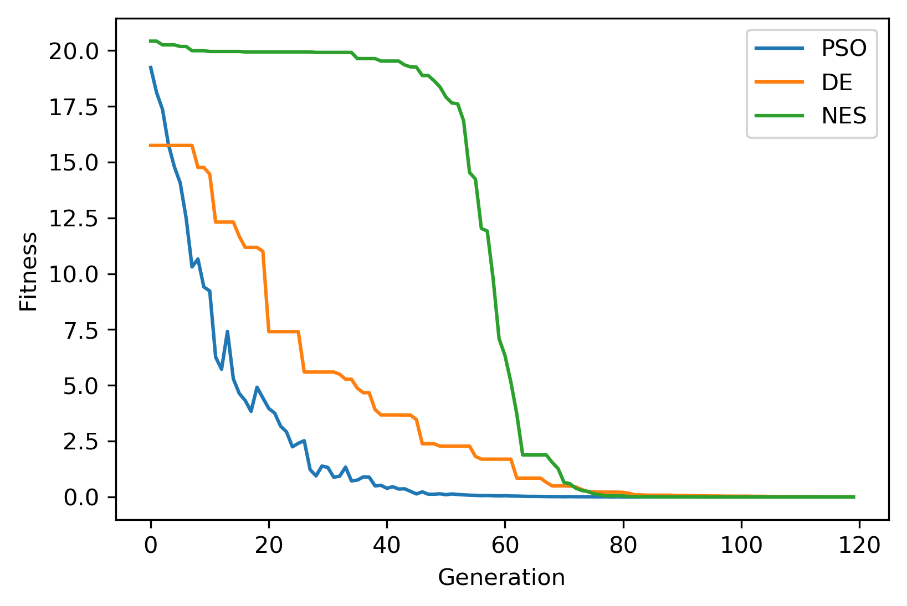

.. _ex2:

Example 2
===========

Example of solving the popular continuous optimization function "Ackley" using NEORL with evolutionary algorithms.

Summary
--------------------

-  Algorithms: PSO, NES, DE 
-  Type: Continuous, Single-objective, Unconstrained
-  Field: Mathematical Optimization
 

Problem Description
--------------------

The mathematical definition of Ackley is:

.. math::

   f(\vec{x}) = 20-20exp\Big(-0.2\sqrt{\frac{1}{n}\sum_{i=1}^{n}x_i^2}\Big)-exp\Big(\frac{1}{n}\sum_{i=1}^{n}cos(2\pi x_i)\Big) + exp(1) 

The Ackley function is continuous, non-convex and multimodal. This plot shows Ackley in two-dimensional (:math:`d=2`) form.

   
:math:`\vec{x}` domain:
The function is usually evaluated on the hypercube :math:`x_i \in [-32, 32]`, for all :math:`i = 1, …, d`. The global minima for the Ackley function is:

.. math::

   f(\vec{x}^*)=0, \text{ at } \vec{x}^*=[0,0,...,0]
   
   
NEORL script
--------------------

The solution below is for a 10-dimensional Ackley function (:math:`d=10`)

.. code-block:: python

	#---------------------------------
	# Import packages
	#---------------------------------
	import numpy as np
	import matplotlib.pyplot as plt
	from neorl import PSO, DE, XNES
	from math import exp, sqrt, cos, pi
	np.random.seed(50)
	
	#---------------------------------
	# Fitness function
	#---------------------------------
	def ACKLEY(individual):
	    #Ackley objective function.
	    d = len(individual)
	    f=20 - 20 * exp(-0.2*sqrt(1.0/d * sum(x**2 for x in individual))) \
	            + exp(1) - exp(1.0/d * sum(cos(2*pi*x) for x in individual))
	    return f
	
	#---------------------------------
	# Parameter Space
	#---------------------------------
	#Setup the parameter space (d=8)
	d=8
	lb=-32
	ub=32
	BOUNDS={}
	for i in range(1,d+1):
	    BOUNDS['x'+str(i)]=['float', lb, ub]
	
	#---------------------------------
	# PSO
	#---------------------------------
	pso=PSO(mode='min', bounds=BOUNDS, fit=ACKLEY, npar=60, 
	        c1=2.05, c2=2.1, speed_mech='constric', seed=1)
	x_best, y_best, pso_hist=pso.evolute(ngen=120, verbose=1)
	
	#---------------------------------
	# DE
	#---------------------------------
	de=DE(mode='min', bounds=BOUNDS, fit=ACKLEY, npop=60, 
	      F=0.5, CR=0.7, ncores=1, seed=1)
	x_best, y_best, de_hist=de.evolute(ngen=120, verbose=1)
	
	#---------------------------------
	# NES
	#---------------------------------
	amat = np.eye(d)
	xnes = XNES(mode='min', fit=ACKLEY, bounds=BOUNDS, A=amat, npop=60, 
	            eta_Bmat=0.04, eta_sigma=0.1, adapt_sampling=True, ncores=1, seed=1)
	x_best, y_best, nes_hist=xnes.evolute(120, verbose=1)
	
	#---------------------------------
	# Plot
	#---------------------------------
	#Plot fitness for both methods
	plt.figure()
	plt.plot(np.array(pso_hist), label='PSO')           
	plt.plot(np.array(de_hist), label='DE')            
	plt.plot(np.array(nes_hist['fitness']), label='NES')
	plt.xlabel('Generation')
	plt.ylabel('Fitness')
	plt.legend()
	plt.savefig('ex2_fitness.png',format='png', dpi=300, bbox_inches="tight")
	plt.show()

 
Results
--------------------

Result summary is below for the three methods in minimizing the Ackley function.

.. code-block:: python

	------------------------ PSO Summary --------------------------
	Best fitness (y) found: 6.384158766614689e-05
	Best individual (x) found: [-1.1202021943594622e-05, 1.3222010570577733e-05, -1.0037727362601807e-05, 9.389429054206202e-06, 2.4880207036828872e-05, 1.6872593760849828e-05,    2.076883222303575e-05, 1.458529398292857e-05]
	--------------------------------------------------------------
	------------------------ DE Summary --------------------------
	Best fitness (y) found: 0.0067943767106268815
	Best individual (x) found: [-0.0025073247154970765, 0.0020192971595931735, -0.0015127342773181872, -0.0010888556350037238, -0.0015830291353966849, -0.000743962941194097, 0.0002963358699222367, 0.002260054765774109]
	--------------------------------------------------------------
	------------------------ NES Summary --------------------------
	Best fitness (y) found: 1.5121439047582896e-06
	Best individual (x) found: [ 5.01688814e-07 -1.12353966e-07  7.64184537e-08  1.37674119e-08
	  3.66277722e-07 -5.94627000e-07  3.11206449e-08 -6.19858494e-07]
	--------------------------------------------------------------
