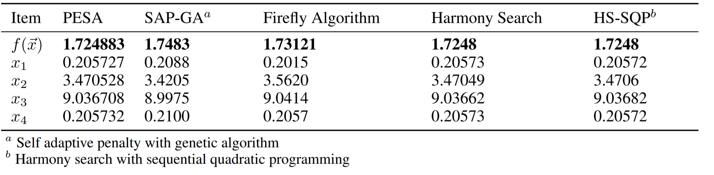

.. _ex3:

Example 3
===========

Example of solving the heavily-constrained engineering optimization problem "Welded-beam design" using NEORL with the PESA hybrid algorithm.

Summary
--------------------

-  Algorithms: PESA
-  Type: Continuous, Single-objective, Constrained
-  Field: Structural Engineering

Problem Description
--------------------

The welded beam is a common engineering optimisation problem with an objective to find an optimal set of the dimensions :math:`h (x_1)`, :math:`l (x_2)`, :math:`t (x_3)`, and :math:`b (x_4)` such that the fabrication cost of the beam is minimized. This problem is a continuous optimisation problem. See the Figure below for graphical details of the beam dimensions (:math:`h, l, t, b`) to be optimised. 

.. image:: ../images/welded-beam.png
   :scale: 50 %
   :alt: alternate text
   :align: center
   
The cost of the welded beam is formulated as 

.. math::

	\min_{\vec{x}} f (\vec{x}) = 1.10471x_1^2x_2 + 0.04811x_3x_4 (14+x_2),

subject to 7 rules/constraints, the first on the shear stress ($\tau$)
	
.. math::

	g_1(\vec{x}) = \tau(\vec{x}) - \tau_{max} \leq 0, 

the second on the bending stress ($\sigma$)

.. math::
	
	g_2(\vec{x}) = \sigma(\vec{x}) - \sigma_{max} \leq 0,  

three side constraints
	
.. math::
	
	g_3(\vec{x}) = x_1 - x_4 \leq 0,  

	
.. math::
	
	g_4(\vec{x}) = 0.10471x_1^2 + 0.04811x_3x_4 (14+x_2) - 5 \leq 0,  

	
.. math::

	g_5(\vec{x}) = 0.125 - x_1 \leq 0,  
	
the sixth on the end deflection of the beam ($\delta$)
	
.. math::
	g_6(\vec{x}) = \delta(\vec{x}) - \delta_{max} \leq 0, 
	

and the last on the buckling load on the bar ($P_c$)
	
.. math::
	
	g_7(\vec{x}) = P - P_{c}(\vec{x}) \leq 0, 
	
while the range of the design variables are:

.. math::
	    \begin{split}
	         0.1 \leq x_1 \leq 2 &, \quad 0.1 \leq x_2 \leq 10, \\
	         0.1 \leq x_3 \leq 10 &, \quad 0.1 \leq x_4 \leq 2. \\
	    \end{split}

	
The derived variables and their related constants are expressed as follows \cite{coello2000use}:
	
.. math::

	\tau(\vec{x}) = \sqrt{(\tau')^2 + 2\tau' \tau'' \frac{x_2}{2R}+(\tau'')^2},
	
.. math::

	\tau' = \frac{P}{\sqrt{2}x_1x_2}, \tau''=\frac{MR}{J}, M= P (L+x_2/2),

.. math::
	
	R= \sqrt{\frac{x_2^2}{4}+\frac{(x_1+x_3)^2}{4}},

	
.. math::

	J= 2\Bigg[\sqrt{2}x_1x_2 \Bigg(\frac{x_2^2}{12} + \frac{(x_1+x_3)^2}{4} \Bigg) \Bigg],
	
.. math::

	\sigma(\vec{x}) = \frac{6PL}{x_4x_3^2},
	
.. math::
	
	\delta(\vec{x}) = \frac{4PL^3}{Ex_3^3x_4},
	
.. math::

	P_c(\vec{x}) = \frac{4.013E\sqrt{\frac{x_3^2x_4^6}{36}}}{L^2}\Bigg(1-\frac{x_3}{2L}\sqrt{\frac{E}{4G}}\Bigg),
	
.. math::

	\begin{split}
	   P &= 6000 \text{ lb} , L =14 \text{ in},  E=30\times 10^6 \text{ psi}, \\ 
	   G &= 12 \times 10^6 \text{ psi}, \\
	   \tau_{max} & =13,600 \text{ psi}, \sigma_{max} = 30,000 \text{ psi}, \delta_{max} = 0.25 \text{ in}
	\end{split}

NEORL script
--------------------

.. code-block:: python

	#---------------------------------
	# Import packages
	#---------------------------------
	import numpy as np
	import matplotlib.pyplot as plt
	from neorl import PESA
	from math import exp, sqrt, cos, pi
	np.random.seed(42)
	
	#---------------------------------
	# Fitness function
	#---------------------------------
	def ACKLEY(individual):
	    #Ackley objective function.
	    d = len(individual)
	    f=20 - 20 * exp(-0.2*sqrt(1.0/d * sum(x**2 for x in individual))) \
	            + exp(1) - exp(1.0/d * sum(cos(2*pi*x) for x in individual))
	    return -f   #-1 to convert to maximization problem
	
	#---------------------------------
	# Parameter Space
	#---------------------------------
	#Setup the parameter space (d=8)
	d=8
	lb=-32
	ub=32
	BOUNDS={}
	for i in range(1,d+1):
	    BOUNDS['x'+str(i)]=['float', lb, ub]
	
	#---------------------------------
	# PESA
	#---------------------------------
	pesa=PESA(bounds=BOUNDS, fit=FIT, ngen=NGEN, npop=NPOP, memory_size=MEMORY_SIZE, pop0=pop0, mode=MODE, 
              alpha0=ALPHA0, alpha1=ALPHA1, warmup=None, chi=CHI, replay_rate=REPLAY_RATE, Tmax=TMAX, 
              mu=MU, cxpb=CXPB, mutpb=MUTPB, c1=C1, c2=C2, speed_mech=SPEED_MECH, pso_flag=True, verbose=0)

	xpesa_best, ypesa_best= pesa.evolute()
	
	#---------------------------------
	# Plot
	#---------------------------------
	#Plot fitness for both methods
	plt.figure()
	plt.plot(-np.array(pso_hist), label='PSO')             #multiply by -1 to covert back to a min problem
	plt.plot(-np.array(de_hist), label='DE')               #multiply by -1 to covert back to a min problem
	plt.plot(-np.array(nes_hist['fitness']), label='NES')  #multiply by -1 to covert back to a min problem
	plt.xlabel('Generation')
	plt.ylabel('Fitness')
	plt.legend()
	plt.savefig('ex2_fitness.png',format='png', dpi=300, bbox_inches="tight")
	plt.show()

 
Results
--------------------

The convergence of the fitness function is shown below

.. image:: ../images/ex2_fitness.png
   :scale: 30%
   :alt: alternate text
   :align: center

After detailed hyperparameter tuning, PESA can achieve competitive performance for the welded beam design compared to other algorithms in the literature

