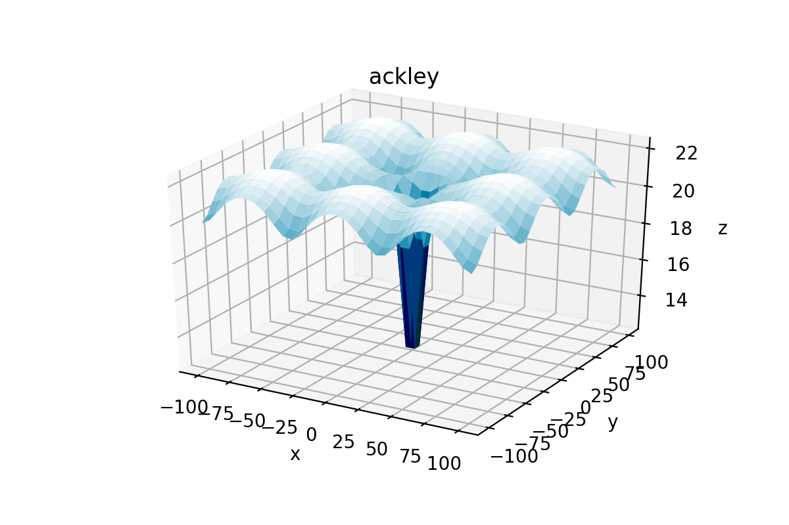

.. _ex4:

Example 4: Benchmarks
======================

Example of accessing and plotting the built-in benchmark functions in NEORL. 

Summary
--------------------

-  Algorithms: No Algorithms 
-  Type: Continuous, Single-objective
-  Field: Benchmarking, Mathematical Optimization

Problem Description
--------------------
   
We present an overview of how to access the benchmark functions in NEORL to allow easy testing of different algorithms within the framework. For example, a long list of classical mathematical functions is saved within NEORL such as the Rosenbrock function

.. math::

	f(\vec{x}) = \sum_{i=1}^{d-1} (1-x_i)^2 + 100 (x_{i+1} - x_i^2 )^2  

or Ackley function

.. math::

   f(\vec{x}) = 20-20exp\Big(-0.2\sqrt{\frac{1}{d}\sum_{i=1}^{d}x_i^2}\Big)-exp\Big(\frac{1}{d}\sum_{i=1}^{d}cos(2\pi x_i)\Big) + exp(1)

or Bohachevsky function

.. math::

	f(\vec{x}) = \sum_{i=1}^{d-1}(x_i^2 + 2x_{i+1}^2 - 0.3\cos(3\pi x_i) - 0.4\cos(4\pi x_{i+1}) + 0.7)
	                   
More recent and advanced benchmark functions were also developed such as the CEC'2017 test suite, which includes 30 benchmark functions divided into three groups: Simple (f1-f10), Hybrid (f11-f20), and Composition (f21-f30). The core of the CEC'2017 functions is similar to the classical functions listed above. However, CEC'2017 functions are rotated and shifted to make them more complex to optimise. **CEC'2017 functions are only defined at specific dimensions, namely,** ``d=2, 10, 20, 30, 50 or 100``.

NEORL script
--------------------

.. code-block:: python

	import numpy as np
	import neorl.benchmarks.cec17 as functions    #import all cec17 functions
	import neorl.benchmarks.classic as classics   #import all classical functions
	from neorl.benchmarks.classic import ackley, levy, bohachevsky  #import specific functions
	from neorl.benchmarks.cec17 import f3, f10, f21  #import cec17 specific functions 
	from neorl.benchmarks import bench_2dplot   #import the built-in plotter
	
	d1 = 2 #set dimension for classical functions
	d2 = 10 #set dimension for cec functions (choose between 2, 10, 20, 30, 50 or 100)
	print('------------------------------------------------------')
	print('Classical Functions')
	print('------------------------------------------------------')
	
	for f in classics.all_functions:
	    sample = np.random.uniform(low=0, high=10, size=d1)
	    y = f(sample)
	    print('Function: {}, x={}, y={}'.format(f.__name__, np.round(sample,2), np.round(y,2)))
	
	print('------------------------------------------------------')
	print('CEC2017 Functions')
	print('------------------------------------------------------')
	for f in functions.all_functions:
	    sample = np.random.uniform(low=-10, high=10, size=d2)
	    y = f(sample)
	    print('Function: {}, x={}, y={}'.format(f.__name__, np.round(sample,2), np.round(y,2)))
	
	print('------------------------------------------------------')
	print('Function Plotter')
	print('------------------------------------------------------')
	bench_2dplot(f3, domain=(-50,50), points=60)
	bench_2dplot(f10, savepng='ex4_f10.png')
	bench_2dplot(f21, savepng='ex4_f21.png')
	
	bench_2dplot(ackley, savepng='ex4_ackley.png')
	bench_2dplot(levy, domain=(-10,10))
	bench_2dplot(bohachevsky, points=50)
	
	#------------------------------------------------------------------------------
	#NOTE: CEC'17 functions: f11-f20, f29, f30 are not defined for d=2 dimensions, 
	#so the plotter will FAIL for these functions
	#------------------------------------------------------------------------------

 
Results
--------------------

Selected results from the script output are shown below, which indicates the function evaluation with a random sample 

.. code-block:: python

	------------------------------------------------------
	Classical Functions
	------------------------------------------------------
	Function: sphere, x=[4.17 7.2 ], y=69.28
	Function: cigar, x=[0.   3.02], y=9140499.76
	Function: rosenbrock, x=[1.47 0.92], y=151.59
	Function: bohachevsky, x=[1.86 3.46], y=27.63
	Function: griewank, x=[3.97 5.39], y=0.48
	Function: rastrigin, x=[4.19 6.85], y=74.97
	Function: ackley, x=[2.04 8.78], y=15.35
	.
	.
	.
	
	------------------------------------------------------
	CEC2017 Functions
	------------------------------------------------------
	Function: f1, x=[ 3.89 -1.72 -9.    0.72  3.28  0.3   8.89  1.73  8.07 -7.25], y=276294024527.33
	Function: f2, x=[-7.21  6.15 -2.05 -6.69  8.55 -3.04  5.02  4.52  7.67  2.47], y=1.39057e+18
	Function: f3, x=[ 5.02 -3.02 -4.6   7.92 -1.44  9.3   3.27  2.43 -7.71  8.99], y=104499271.6
	Function: f4, x=[-1.    1.57 -1.84 -5.26  8.07  1.47 -9.94  2.34 -3.47  0.54], y=6142.43
	Function: f5, x=[ 7.72 -2.85  8.17  2.47 -9.68  8.59  3.82  9.95 -6.55 -7.26], y=738.82
	Function: f6, x=[ 8.65  3.94 -8.68  5.11  5.08  8.46  4.23 -7.51 -9.6  -9.48], y=817.43
	Function: f7, x=[-9.43 -5.08  7.2   0.78  1.06  6.84 -7.52 -4.42  1.72  9.39], y=916.24
	.
	.
	.
	------------------------------------------------------
	Function Plotter
	------------------------------------------------------	
	.
	.
	.
	
Few samples from the function plots are shown below

.. image:: ../images/ex4_f10.png
   :scale: 50%
   :alt: alternate text
   :align: center
 
.. image:: ../images/ex4_f21.png
   :scale: 50%
   :alt: alternate text
   :align: center
 
