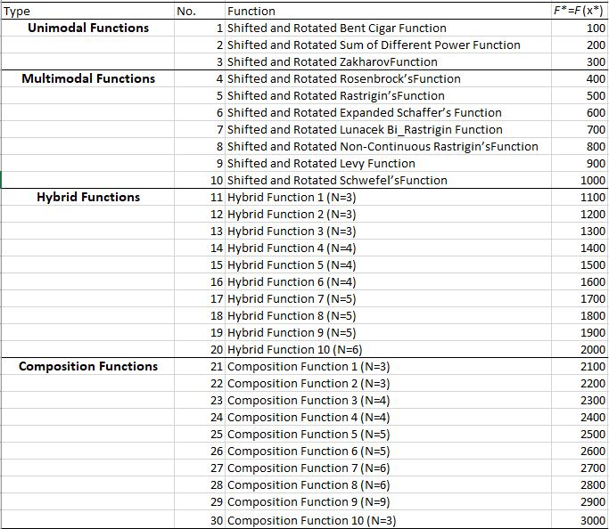

.. _ex5:

Example 5
===========

Example of solving the first 10 benchmark functions in CEC'2017 test suite with dimensionality ``d=2`` using Differential Evolution.  

Summary
--------------------

-  Algorithms: DE
-  Type: Continuous, Single-objective
-  Field: Benchmarking, Mathematical Optimization 

Problem Description
--------------------

The following notes are appliable to all test functions in CEC'2017

- All test functions in CEC'2017 are shifted by the vector :math:`\vec{o}`.
- Search range for all functions is :math:`[-100,100]^d`.
- :math:`\mathbf{M}_i` is the rotation matrix. Different rotation matrices are assigned to each function in the test suite.
- The shifted and rotated function is defined as :math:`F_i = f_i(\mathbf{M}(\vec{x}-\vec{o})) + F_i^*`

Where :math:`f(.)` is the base function obtained from the classical functions group (e.g. Zakharov, Cigar, Rosenbrock). The list of the functions in CEC'2017 is shown below based on the reference indicated at the table bottom. 

NEORL script
--------------------

.. code-block:: python

	import numpy as np
	import neorl.benchmarks.cec17 as functions    #import all cec17 functions
	from neorl import DE
	
	reduced_func=functions.all_functions[:10] #keep only the first 10 functions
	
	nx = 2 #set dimension
	BOUNDS={}
	for i in range(1,nx+1):
	    BOUNDS['x'+str(i)]=['float', -100, 100]
	
	for FIT in reduced_func:
	    #setup and evolute PSO
	    de=DE(mode='min', bounds=BOUNDS, fit=FIT, npop=60, F=0.5, 
	          CR=0.7, ncores=1, seed=1)
	    x_best, y_best, de_hist=de.evolute(ngen=100, verbose=0)
	    opt=float(FIT.__name__.strip('f'))*100
	    print('Function: {}, x-DE={}, y-DE={}, y-Optimal={}'.format(FIT.__name__, 
	                                                             np.round(x_best,2), 
	                                                             np.round(y_best,2), 
	                                                             opt))

 
Results
--------------------

After running the script above, the output looks like below, which shows that DE was able to converge to the optimal value for all functions, of course, because the problem is simple with ``d=2`` dimensions.  

.. code-block:: python

	Function: f1, x-DE=[-55.28 -70.43], y-DE=100.0, y-Optimal=100.0
	Function: f2, x-DE=[-29.34 -17.05], y-DE=200.0, y-Optimal=200.0
	Function: f3, x-DE=[-55.94   4.54], y-DE=300.0, y-Optimal=300.0
	Function: f4, x-DE=[32.51  7.76], y-DE=400.0, y-Optimal=400.0
	Function: f5, x-DE=[-17.41  56.17], y-DE=500.0, y-Optimal=500.0
	Function: f6, x-DE=[ 79.09 -24.57], y-DE=600.0, y-Optimal=600.0
	Function: f7, x-DE=[-46.65  42.28], y-DE=700.32, y-Optimal=700.0
	Function: f8, x-DE=[ 32.16 -55.97], y-DE=800.0, y-Optimal=800.0
	Function: f9, x-DE=[-24.48   2.3 ], y-DE=900.0, y-Optimal=900.0
	Function: f10, x-DE=[-15.95 -59.89], y-DE=1000.33, y-Optimal=1000.0