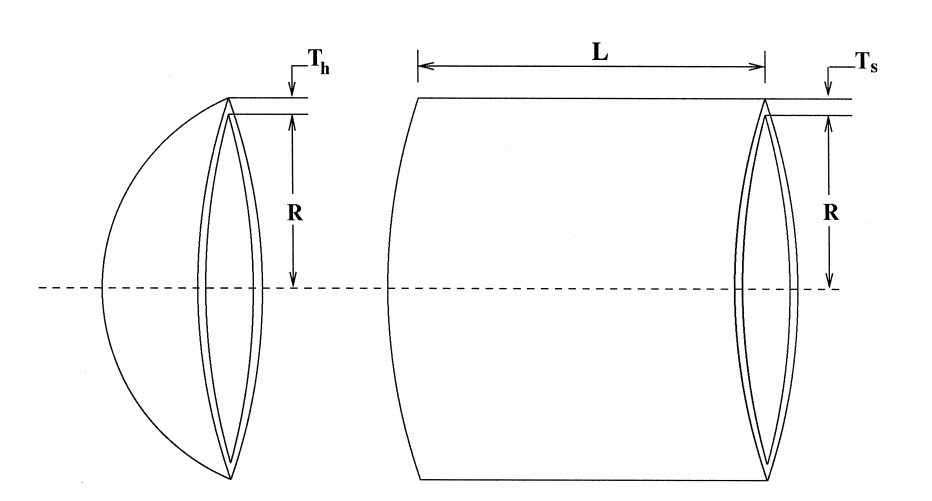

.. _ex8:

Example 8: Pressure Vessel Design with Demonstration of Categorical Parameter
==============================================================================

Example of solving the constrained engineering optimization problem "Pressure vessel design" using NEORL with HHO, ES, PESA, and BAT algorithms to demonstrate compatibility with mix of continuous, discrete, and categorical spaces.

Summary
--------------------

-  Algorithms: HHO, ES, PESA, BAT
-  Type: Mixed discrete-continuous-categorical, Single-objective, Constrained
-  Field: Mechanical Engineering

Problem Description
--------------------

The pressure vessel design is an engineering optimization problem with the objective to evaluate the optimal thickness of shell (:math:`T_s`), thickness of head (:math:`T_h`), inner radius (R), and length of shell (L) such that the total cost of material, forming, and welding is minimized accounting for 4 constraints. :math:`T_s` and :math:`T_h` are integer multiples of 0.0625 in., which are the available thicknesses of rolled steel plates, and R and L are continuous. Unlike :ref:`Example 7 <ex7>`, :math:`T_h` will be modeled as a categorical parameter to demonstrate compatibility with a mix of continuous, discrete, and categorical parameters. The figure below shows the dimensions of the pressure vessel structure. 

   
The equation for the cost of the pressure vessel is 

.. math::

	\min_{\vec{x}} f (\vec{x}) = 0.6224x_1x_3x_4 + 1.7781x_2x_3^2 + 3.1661x_1^2x_4 + 19.84x_1^2x_3,

subject to 4 constraints 
	
.. math::

	g_1 = -x_1 + 0.0193x_3 \leq 0,
	
	g_2 = -x_2 + 0.00954x_3 \leq 0,
	
	g_3 = -\pi x_3^2x_4 - \frac{4}{3} \pi x_3^3 + 1296000 \leq 0,

	g_4 = x_4 - 240 \leq 0,

where :math:`0.0625 \leq x_1 \leq 6.1875` (with step of 0.0625), :math:`x_2 \in \{0.0625, 0.125, 0.1875, 0.25, 0.3125, 0.375, 0.4375, 0.5, 0.5625, 0.625\}`, :math:`10 \leq x_3 \leq 200`, and :math:`10 \leq x_4 \leq 200`.

NEORL script
--------------------

.. literalinclude :: ../scripts/ex8_mixed.py
   :language: python
 
Results
--------------------

A summary of the results is shown below with the best :math:`(x_1, x_2, x_3, x_4)` and :math:`y=f(x)` (minimum vessel cost). The figure is zoomed to a relevant y-scale that shows all methods clearly. HHO is best algorithm for this case. 

.. image:: ../images/ex8_pv_fitness.png
   :scale: 30%
   :alt: alternate text
   :align: center

.. code-block:: python

	------------------------ HHO Summary --------------------------
	Function: Vessel
	Best fitness (y) found: 6076.871989481831
	Best individual (x) found: [13.0, 0.4375, 41.958165787313035, 178.38267571773872]
	--------------------------------------------------------------
	------------------------ ES Summary --------------------------
	Best fitness (y) found: 6689.115350860009
	Best individual (x) found: [17, 0.5, 52.39036909796362, 80.46789374601103]
	--------------------------------------------------------------
	------------------------ PESA Summary --------------------------
	Best fitness (y) found: 6420.244320020875
	Best individual (x) found: [15, 0.5, 48.11672433151982, 114.1606860286298]
	--------------------------------------------------------------
	------------------------ BAT Summary --------------------------
	Best fitness (y) found: 6194.304291280144
	Best individual (x) found: [13.0, 0.4375, 41.040436491185176, 190.26719495938994]
	--------------------------------------------------------------