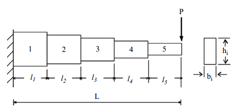
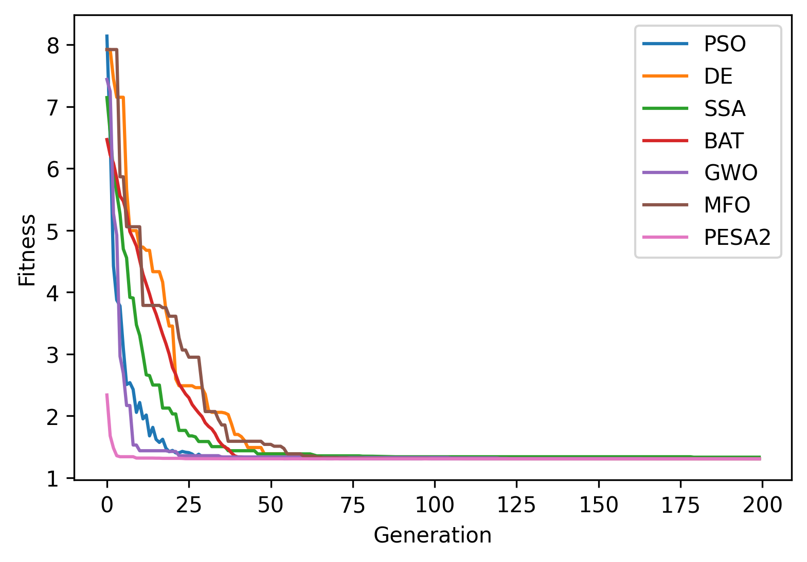

.. _ex9:

Example 9: Cantilever Stepped Beam
=====================================

Example of solving the constrained engineering optimization problem "Cantilever Stepped Beam" as well as a simpler square case using NEORL with the PSO, DE, SSA, GWO, MFO, BAT, and PESA2 algorithms.

Summary
--------------------

-  Algorithms: PSO, DE, SSA, GWO, MFO, BAT, PESA2
-  Type: Continuous, Single-objective, Constrained
-  Field: Structural Engineering

Problem Description
--------------------

The cantilever stepped beam design is an engineering optimization problem with the objective to evaluate the optimal heights :math:`x_1 - x_5` and widths :math:`x_6 - x_{10}` of the five rectangular segments such that the volume of the statically loaded cantilever beam is minimized accounting for stress :math:`(\sigma)` constraints. The figure below shows the dimensions of the cantilever structure

   
The equation for the volume of the cantilever beam is 

.. math::

	\min_{\vec{x}} f (\vec{x}) = \sum_{i=1}^{5} x_i x_{i+5} l_i,
  
where :math:`l_i` = 100 cm. The design is subject to 11 constraints:
	
.. math::

	g_1 = \frac{P l_5}{x_5 x_{10}^2} - 14000 \leq 0,
	
	g_2 = \frac{P (l_5 + l_4)}{x_4 x_9^2} - 14000 \leq 0,
	
	g_3 = \frac{P (l_5 + l_4 + l_3)}{x_3 x_8^2} - 14000 \leq 0,
  
  g_4 = \frac{P (l_5 + l_4 + l_3 + l_2)}{x_2 x_7^2} - 14000 \leq 0,
  
  g_5 = \frac{P (l_5 + l_4 + l_3 + l_2 + l_1)}{x_1 x_6^2} - 14000 \leq 0,
  
  g_6 = \frac{x_{10}}{x_5} - 20 \leq 0,
  
  g_7 = \frac{x_9}{x_4} - 20 \leq 0,
  
  g_8 = \frac{x_8}{x_3} - 20 \leq 0,
  
  g_9 = \frac{x_7}{x_2} - 20 \leq 0,
  
  g_{10} = \frac{x_6}{x_1} - 20 \leq 0,
  
  g_{11} = \frac{P l^3}{3 E} \left( \frac{1}{I_5} +\frac{7}{I_4} + \frac{19}{I_3} + \frac{37}{I_2} + \frac{61}{I_1} \right)-2.7 \leq 0,

where :math:`1 \leq x_i \leq 5` :math:`(i = 1,2, \ldots, 5)`, :math:`30 \leq x_i \leq 65` :math:`(i = 6,7,\ldots,10)`, :math:`P = 50,000 N`, and :math:`E = 2 \times 10^7 N/cm^2`.

NEORL script
--------------------

.. code-block:: python

	#---------------------------------
	# Import packages
	#---------------------------------
	import numpy as np
	import matplotlib.pyplot as plt
	from neorl import PSO, DE, SSA, GWO, MFO, BAT, PESA2
	
	#---------------------------------
	# Fitness function
	#---------------------------------
	def CSB(individual):
	  """Cantilever Stepped Beam
	  individual[i = 0 - 4] are beam widths
	  individual[i = 5 - 9] are beam heights
	  """
	
	  check=all([item >= BOUNDS['x'+str(i+1)][1] for i,item in enumerate(individual)]) \
			and all([item <= BOUNDS['x'+str(i+1)][2] for i,item in enumerate(individual)])
	  if not check:
		  raise Exception ('--error check fails')
	
	  P = 50000
	  E = 2 * 10**7
	  l = 100
	  g = np.zeros(11)
	  g[0] = 600*P/(individual[4] * individual[9]**2) - 14000
	  g[1] = 6*P*(2*l)/(individual[3] * individual[8]**2) - 14000
	  g[2] = 6*P*(3*l)/(individual[2] * individual[7]**2) - 14000
	  g[3] = 6*P*(4*l)/(individual[1] * individual[6]**2) - 14000
	  g[4] = 6*P*(5*l)/(individual[0] * individual[5]**2) - 14000
	  g[5] = 0
	  g[6] = individual[9]/individual[4] - 20
	  g[7] = individual[8]/individual[3] - 20
	  g[8] = individual[7]/individual[2] - 20
	  g[9] = individual[6]/individual[1] - 20
	  g[10] = individual[5]/individual[0] - 20
	
	  g_round=np.round(g,6)
	  w1=1000
	  w2=1000
	
	  phi=sum(max(item,0) for item in g_round)
	  viol=sum(float(num) > 0 for num in g_round)
	
	  V = 0
	  for i in range(5):
		  V += individual[i] * individual[i+5] * l
		  
	  return V + w1*phi + w2*viol
	
	#---------------------------------
	# Parameter space
	#---------------------------------
	nx=10
	BOUNDS={}
	for i in range(1, 6):
	  BOUNDS['x'+str(i)]=['float', 1, 5]
	for i in range(6, 11):
	  BOUNDS['x'+str(i)]=['float', 30, 65]
	
	#---------------------------------
	# PSO
	#---------------------------------
	pso=PSO(mode='min', bounds=BOUNDS, fit=CSB, c1=2.05, c2=2.1, npar=50, speed_mech='constric', ncores=1, seed=1)
	pso_x, pso_y, pso_hist=pso.evolute(ngen=300, verbose=0)
	
	#---------------------------------
	# DE
	#---------------------------------
	de=DE(mode='min', bounds=BOUNDS, fit=CSB, npop=50, F=0.5, CR=0.7, ncores=1, seed=1)
	de_x, de_y, de_hist=de.evolute(ngen=300, verbose=0)
	
	#---------------------------------
	# SSA
	#---------------------------------
	ssa=SSA(mode='min', bounds=BOUNDS, fit=CSB, nsalps=50, c1=None, ncores=1, seed=1)
	ssa_x, ssa_y, ssa_hist=ssa.evolute(ngen=300, verbose=0)
	
	#---------------------------------
	# BAT
	#---------------------------------
	bat=BAT(mode='min', bounds=BOUNDS, fit=CSB, nbats=50, fmin = 0 , fmax = 1, A=0.5, r0=0.5, levy = True, seed = 1, ncores=1)
	bat_x, bat_y, bat_hist=bat.evolute(ngen=300, verbose=0)
	
	#---------------------------------
	# GWO
	#---------------------------------
	gwo=GWO(mode='min', fit=CSB, bounds=BOUNDS, nwolves=50, ncores=1, seed=1)
	gwo_x, gwo_y, gwo_hist=gwo.evolute(ngen=300, verbose=0)
	
	#---------------------------------
	# MFO
	#---------------------------------
	mfo=MFO(mode='min', bounds=BOUNDS, fit=CSB, nmoths=50, b = 0.2, ncores=1, seed=1)
	mfo_x, mfo_y, mfo_hist=mfo.evolute(ngen=300, verbose=0)
	
	#---------------------------------
	# PESA2
	#---------------------------------
	pesa2=PESA2(mode='min', bounds=BOUNDS, fit=CSB, npop=50, nwolves=5, ncores=1, seed=1)
	pesa2_x, pesa2_y, pesa2_hist=pesa2.evolute(ngen=600, replay_every=2, verbose=0)
	
	#---------------------------------
	# Plot
	#---------------------------------
	plt.figure()
	plt.plot(pso_hist, label = 'PSO')
	plt.plot(de_hist, label = 'DE')
	plt.plot(ssa_hist['global_fitness'], label = 'SSA')
	plt.plot(bat_hist['global_fitness'], label = 'BAT')
	plt.plot(gwo_hist['fitness'], label = 'GWO')
	plt.plot(mfo_hist['global_fitness'], label = 'MFO')
	plt.plot(pesa2_hist, label = 'PESA2')
	plt.legend()
	plt.xlabel('Generation')
	plt.ylabel('Fitness')
	plt.ylim(0,150000)
	plt.savefig('CSB_fitness.png',format='png', dpi=300, bbox_inches="tight")

 
Results
--------------------

A summary of the results for the different methods is shown below with the best :math:`\vec{x}` and :math:`y=f(x)` (minimum volume). DE and PESA2 show the best results

.. image:: ../images/CSB_fitness.png
   :scale: 30%
   :alt: alternate text
   :align: center

.. code-block:: python

	------------------------ PSO Summary --------------------------
  Best fitness (y) found: 67335.91306205148
  Best individual (x) found: [3.5688543506518657, 2.7791479019993583, 2.525097748486896, 2.5931709214818746, 3.0184400437701497, 54.792949608125554, 55.55687861890972, 50.45798494270985, 40.66285990348347, 30]
  --------------------------------------------------------------
	------------------------ DE Summary --------------------------
  Best fitness (y) found: 62253.08088965673
  Best individual (x) found: [3.0024484908957634, 2.805060577916484, 2.5489794459150485, 2.2104364777790244, 1.7812440232731417, 59.83601779613085, 55.29672939889619, 50.28650239860514, 44.1239666136573, 34.83693680366301]
  --------------------------------------------------------------
	------------------------ SSA Summary --------------------------
  Best fitness (y) found: 64883.21386055779
  Best individual (x) found: [ 3.01217612  3.12691389  2.66584391  2.56789564  2.26413108 59.64053204
   52.35626719 49.10660541 40.85291814 30.76422498]
  --------------------------------------------------------------
  ------------------------ BAT Summary --------------------------
  Best fitness (y) found: 85509.99706478164
  Best individual (x) found: [ 3.24944962  3.15901556  3.71034211  2.88044491  2.72539593 57.42189701
   63.18019888 41.62463495 57.60433819 54.50783013]
  --------------------------------------------------------------
  ------------------------ GWO Summary --------------------------
  Best fitness (y) found: 64217.56500668205
  Best individual (x) found: [ 3.0490241   2.82805632  2.54882906  2.60647295  1.91892183 59.32877115
   55.25800387 50.22171706 40.6816295  36.98217938]
  --------------------------------------------------------------
  ------------------------ MFO Summary --------------------------
  Best fitness (y) found: 68284.66539072228
  Best individual (x) found: [ 3.00200798  3.04903017  2.52470544  4.76307633  2.38149254 59.7430926
   53.04777538 50.46763269 30.00000001 30.00007271]
  --------------------------------------------------------------
  ------------------------PESA2 Summary-------------------------
  Best fitness (y) found: 62491.80715494685
  Best individual (x) found: [3.0160894636962894, 2.7812536032709683, 2.5788148288206765, 2.22105253054037, 1.9267356857359532, 59.60349505892154, 55.515872598414006, 49.94170599870354, 43.93631599428571, 33.408629968533766]
  --------------------------------------------------------------
  
  
Simple Square Case
-------------------

A simpler case of the cantilever stepped beam design is shown in the figure below where the heights and widths of each section of the beam are equal :math:`(x_i = x_{i+5})` and the cantilever is hollow with constant thickness. 
  
.. image:: ../images/CSB_square_diagram.png
   :scale: 90%
   :alt: alternate text
   :align: center

The equation for the volume of the square cantilever beam is 

.. math::

	\min_{\vec{x}} f (\vec{x}) = 0.0624 \sum_{i=1}{5} x_i,

with a single constraint

.. math::

	g_1 = \frac{61}{x_1^3} + \frac{37}{x_2^3} + \frac{19}{x_3^3} + \frac{7}{x_4^3} + \frac{1}{x_5^3} - 1 \leq 0,
	
where :math:`0.001 \leq x_i \leq 100`

.. code-block:: python

  #---------------------------------
  # Import packages
  #---------------------------------
  import numpy as np
  from math import cos, pi, exp, e, sqrt
  import matplotlib.pyplot as plt
  from neorl import PSO, DE, SSA, GWO, MFO, BAT, PESA2

  #---------------------------------
  # Fitness function
  #---------------------------------
  def CSB_square(individual):
      """Square Cantilever Stepped Beam
      individual[i = 0 - 4] are beam heights and widths
      """

      check=all([item >= BOUNDS['x'+str(i+1)][1] for i,item in enumerate(individual)]) \
            and all([item <= BOUNDS['x'+str(i+1)][2] for i,item in enumerate(individual)])
      if not check:
          raise Exception ('--error check fails')

      g = 61/individual[0]**3 + 27/individual[1]**3 + 19/individual[2]**3 + 7/individual[3]**3 + 1/individual[4]**3 - 1

      g_round=np.round(g,6)
      w1=1000

      #phi=max(g_round,0)
      if g_round > 0:
          phi = 1
      else:
          phi = 0

      V = 0.0624*(np.sum(individual)) 
      
      return V + w1*phi

  #---------------------------------
  # Parameter space
  #---------------------------------
  nx=5
  BOUNDS={}
  for i in range(1, 6):
      BOUNDS['x'+str(i)]=['float', 0.01, 100]
      
  #---------------------------------
  # PSO
  #---------------------------------
  pso=PSO(mode='min', bounds=BOUNDS, fit=CSB_square, c1=2.05, c2=2.1, npar=50, speed_mech='constric', ncores=1, seed=1)
  pso_x, pso_y, pso_hist=pso.evolute(ngen=200, verbose=0)

  #---------------------------------
  # DE
  #---------------------------------
  de=DE(mode='min', bounds=BOUNDS, fit=CSB_square, npop=50, F=0.5, CR=0.7, ncores=1, seed=1)
  de_x, de_y, de_hist=de.evolute(ngen=200, verbose=0)

  #---------------------------------
  # SSA
  #---------------------------------
  ssa=SSA(mode='min', bounds=BOUNDS, fit=CSB_square, nsalps=50, c1=0.05, ncores=1, seed=1)
  ssa_x, ssa_y, ssa_hist=ssa.evolute(ngen=200, verbose=0)

  #---------------------------------
  # BAT
  #---------------------------------
  bat=BAT(mode='min', bounds=BOUNDS, fit=CSB_square, nbats=50, fmin = 0 , fmax = 1, A=0.5, r0=0.5, levy = True, seed = 1, ncores=1)
  bat_x, bat_y, bat_hist=bat.evolute(ngen=200, verbose=0)

  #---------------------------------
  # GWO
  #---------------------------------
  gwo=GWO(mode='min', bounds=BOUNDS, fit=CSB_square, nwolves=50, ncores=1, seed=1)
  gwo_x, gwo_y, gwo_hist=gwo.evolute(ngen=200, verbose=0)

  #---------------------------------
  # MFO
  #---------------------------------
  mfo=MFO(mode='min', bounds=BOUNDS, fit=CSB_square, nmoths=50, b = 0.2, ncores=1, seed=1)
  mfo_x, mfo_y, mfo_hist=mfo.evolute(ngen=200, verbose=0)

  #---------------------------------
  # PESA2
  #---------------------------------
  pesa2=PESA2(mode='min', bounds=BOUNDS, fit=CSB_square, npop=50, nwolves=5, ncores=1, seed=1)
  pesa2_x, pesa2_y, pesa2_hist=pesa2.evolute(ngen=400, replay_every=2, verbose=0)

  #---------------------------------
  # Plot
  #---------------------------------
  plt.figure()
  plt.plot(pso_hist, label = 'PSO')
  plt.plot(de_hist, label = 'DE')
  plt.plot(ssa_hist['global_fitness'], label = 'SSA')
  plt.plot(bat_hist['global_fitness'], label = 'BAT')
  plt.plot(gwo_hist['fitness'], label = 'GWO')
  plt.plot(mfo_hist['global_fitness'], label = 'MFO')
  plt.plot(pesa2_hist, label = 'PESA2')
  plt.legend()
  plt.xlabel('Generation')
  plt.ylabel('Fitness')
  plt.savefig('CSB_square_fitness.png',format='png', dpi=300, bbox_inches="tight")

Results
--------------------

A summary of the results for the different methods is shown below with the best :math:`\vec{x}` and :math:`y=f(x)` (minimum volume). All methods seem to provide a competitive performance. 

.. code-block:: python

  ------------------------ PSO Summary --------------------------
  Best fitness (y) found: 1.306626656954178
  Best individual (x) found: [5.991862301957736, 4.854008432279021, 4.45906648152542, 3.493259797938664, 2.141332745180214]
  --------------------------------------------------------------
  ------------------------ DE Summary --------------------------
  Best fitness (y) found: 1.3066647539488923
  Best individual (x) found: [5.984617044955957, 4.859363916704608, 4.481939339721313, 3.4787350840537297, 2.1354849022068993]
  --------------------------------------------------------------
  ------------------------ SSA Summary --------------------------
  Best fitness (y) found: 1.3332617264282474
  Best individual (x) found: [6.67840566 4.61630049 4.44312916 3.25464385 2.37389467]
  --------------------------------------------------------------
  ------------------------ BAT Summary --------------------------
  Best fitness (y) found: 1.3066162524125051
  Best individual (x) found: [5.95831939 4.88767148 4.46680068 3.48865088 2.13792058]
  --------------------------------------------------------------
  ------------------------ GWO Summary --------------------------
  Best fitness (y) found: 1.3070265602611708
  Best individual (x) found: [5.96696899 4.86209062 4.45726519 3.45643287 2.2031808 ]
  --------------------------------------------------------------
  ------------------------ MFO Summary --------------------------
  Best fitness (y) found: 1.3074650261970455
  Best individual (x) found: [6.03801813 4.92481126 4.31983845 3.49029899 2.17999833]
  --------------------------------------------------------------
  ------------------------PESA2 Summary-------------------------
  Best fitness (y) found: 1.306682971430895
  Best individual (x) found: [5.946982974266515, 4.920415488921602, 4.4500401873791695, 3.481789428570952, 2.1412041553312333]
  --------------------------------------------------------------

