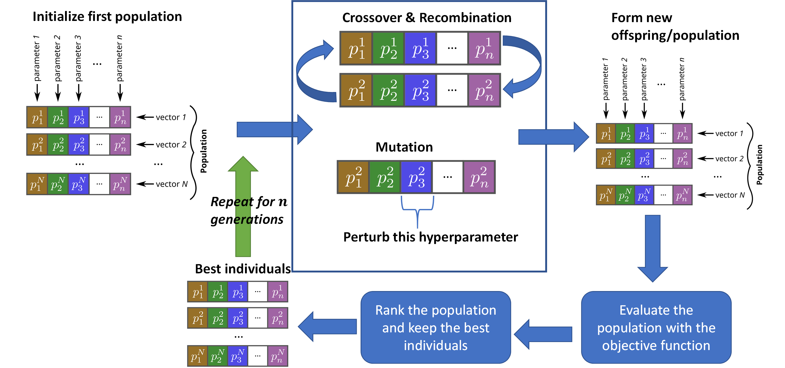

.. _evolu:

==========================
Evolutionary Algorithms
==========================

Evolutionary and Swarm algorithms are a class of computational intelligence that rely on heuristic-based approaches to solve optimization problems, which cannot be easily solved in polynomial time. These problems include NP-Hard combinatorial problems, and similar problems that require too long to process due to the fitness function complexity (e.g. engineering problems, computer simulation). 

The concept of evolutionary algorithms (EA) is quite simple as it follows the process of natural selection and evolution. Genetic algorithms, evolution strategies, and differential evolution are among the most popular  EA. An EA contains four overall stages: initialization, selection, genetic operators, and termination. Typically in an EA, fitter individuals that maximize/minimize the fitness function will survive and proliferate into the next generations, while weak individuals will die off and not contribute to the pool of further generations, just like natural selection processes. A typical workflow of an EA is shown in the figure below. 

   
Swarm intelligence is also another variant of EA and nature-inspired metaheuristics, in which a population of agents are interacting locally with one another and globally with their environment. The inspiration comes from the nature, especially how biological systems interact. The agents follow simple rules and with repeated local and some random interactions between the agents, an emergence of "intelligent" global behavior can be observed among the whole population of agents. For example, this behavior can be seen in ant colonies, bee colonies, and bird flocking movement when searching for food. Among the most common swarm algorithms are particle swarm optimization, ant colony optimization, artificial bee colony, cuckoo search, and many others. 

Currently we have a support of many evolutionary and swarm algorithms, some are listed below:

Evolution Strategies
=====================

See the :ref:`ES <es>` section

Particle Swarm Optimization
=============================

See the :ref:`PSO <pso>` section

Differential Evolution
=============================

See the :ref:`DE <de>` section

Grey Wolf Optimizer 
=============================

See the :ref:`GWO <gwo>` section

Whale Optimization Algorithm
================================

See the :ref:`WOA <woa>` section

Cuckoo Search
=============================

See the :ref:`CS <cs>` section