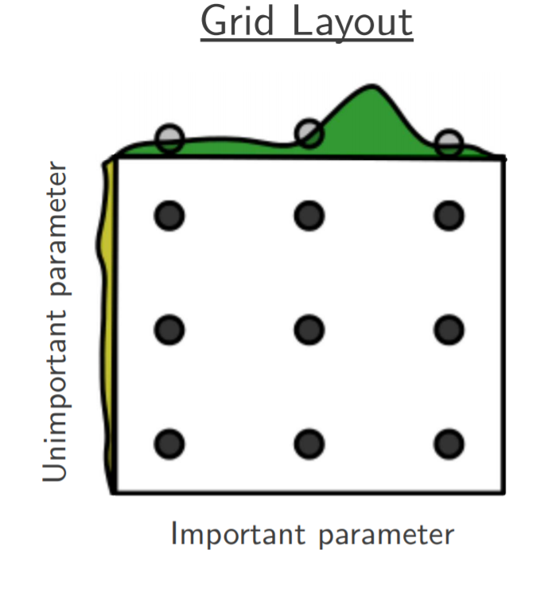
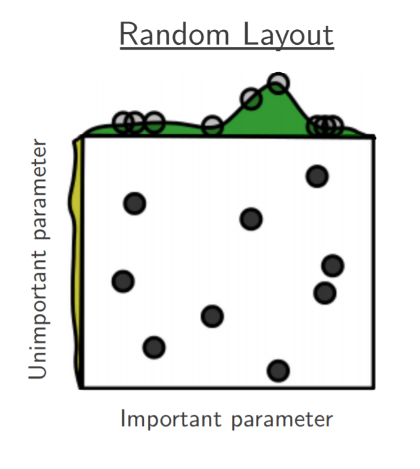

.. _hyperparameter:

=======================
Hyperparameter Tuning
=======================

Hyperparameter tuning is the problem of choosing a set of optimal hyperparameters for a learning algorithm, which includes RL, evolutionary, and neuroevolution algorithms of NEORL. Hyperparameter tuning is effective to maximize the efficiency of the optimization algorithm in hand. In NEORL, we provide different methods to tune hyperparameters, which are highlighted briefly here. 

Grid Search
=============

See the :ref:`Grid Search <grid>` section

Original paper: Bergstra, J., & Bengio, Y. (2012). Random search for hyper-parameter optimization. Journal of machine learning research, 13(2).

Grid Search is an exhaustive search for selecting an optimal set of algorithm hyperparameters. In Grid Search, the analyst sets up a grid of hyperparameter values. A multi-dimensional full grid of all hyperparameters is constructed, which contains all possible combinations of hyperparameters. Afterwards, every combination of hyperparameter values is tested in serial/parallel, where the optimisation score (e.g. fitness) is estimated. Grid search can be very expensive for fine grids as well as large number of hyperparameters to tune. 

For example, to tune few hyperparameters of DQN, the following grids can be defined:

| ``learning_rate`` =[0.0001, 0.00025, 0.0005, 0.00075, 0.001]
| ``batch_size`` =[16, 32, 64]
| ``target_network_update_freq`` =[100, 250, 500, 750, 1000, 1250, 1500, 1750, 2000]
| ``exploration_fraction`` =[0.05, 0.1, 0.15, 0.2, 0.25, 0.3, 0.35]

  
The full grid has a size of = 5*3*9*7= 945 (A total of 945 hyperparameter combinations will be evaluated). Therefore, the cost of grid search is:

.. math::

	Cost = k_1 \times k_2 \times ... \times k_d, 

where :math:`k_i` is the number of nodes in the hyperparameter :math:`i` and :math:`d` is the number of hyperparameters to tune.

Random Search
===============

See the :ref:`Random Search <random>` section

Original paper: Bergstra, J., & Bengio, Y. (2012). Random search for hyper-parameter optimization. Journal of machine learning research, 13(2).

Random search is a technique where random combinations of the hyperparameters are used to find the best solution for the algorithm used. Random search tries random combinations of the hyperparameter set, where the cost function is evaluated at these random sets in the parameter space. As indicated by the reference above, the chances of finding the optimal hyperparameters are comparatively higher in random search than grid search, because of the random search pattern as the algorithm might end up being used on the optimised hyperparameters without any aliasing or wasting of resources.

For example, to tune few hyperparameters of DQN, the parameters can be defined depending on the type:

| ``learning_rate`` = :math:`\mathcal{U}(0.0001, 0.001)` (Parameter type is continuous (``float``) uniform distribution)
| ``batch_size`` = :math:`\mathcal{U}  \{16, 64\}` (Parameter type is discrete (``int``) uniform distribution)
| ``target_network_update_freq`` = :math:`\mathcal{C}  \{100, 500, 1000, 1500\}` (Parameter type is categorical(``grid``))
| ``exploration_fraction`` = :math:`\mathcal{C}\{0.05, 0.1, 0.15\}` (Parameter type is categorical(``grid``))

  
The cost of random search is determined by the total number of random evaluations provided by the user (``ncases``).

Bayesian Search
=========================

See the :ref:`Bayesian Search <bayes>` section

Original paper: https://arxiv.org/abs/1012.2599

Bayesian search, in contrast to grid and random searches, keeps track of past evaluation results. Bayesian uses past evaluations to form a probabilistic model mapping hyperparameters to a probability of a score on the objective function (e.g. max fitness, max reward). Bayesian optimization excels when the objective functions are expensive to evaluate, when we do not have access to derivatives, or when the problem at hand is non-convex. 

The heart of Bayesian optimization is Bayes theorem, which updates our prior beliefs (e.g. hyperparameter values) after new evidence/data is observed (e.g. new fitness values found by the algorithm of interest). The updated beliefs are represented by the posterior distribution, which is used to guide the next round of hyperparameter sampling. Also, Bayesian optimization combines the concepts of "surrogate" models (e.g. Gaussian processes) to accelerate the search, and the "acquisition" function to guide sampling from the posterior  distribution, which both can effectively make a robust search toward the global optima of the cost function (see the Figure below). The sequential-nature of Bayesian optimisation makes its parallelization complex and not natural as grid/random/evolutionary search, which is the obvious downside of Bayesian optimisation.   

.. image:: ../images/bayes.png
   :scale: 50%
   :alt: alternate text
   :align: center

For example, to tune few hyperparameters of DQN by Bayesian search, the parameter space can be defined as:

| ``learning_rate`` = :math:`\mathcal{U}(0.0001, 0.001)` (Parameter type is continuous (``float``) uniform distribution)
| ``batch_size`` = :math:`\mathcal{U}  \{16, 64\}` (Parameter type is discrete (``int``) uniform distribution)
| ``target_network_update_freq`` = :math:`\mathcal{C}  \{100, 500, 1000, 1500\}` (Parameter type is categorical(``grid``))
| ``exploration_fraction`` = :math:`\mathcal{C}\{0.05, 0.1, 0.15\}` (Parameter type is categorical(``grid``))

  
The cost of Bayesian search is determined by the total number of fitness evaluations provided by the user (``ncases``).

Evolutionary Search
=====================

See the :ref:`Evolutionary Search <evolu>` section

Original paper: E. Bochinski, T. Senst and T. Sikora, "Hyper-parameter optimization for convolutional neural network committees based on evolutionary algorithms," 2017 IEEE International Conference on Image Processing (ICIP), Beijing, China, 2017, pp. 3924-3928, doi: 10.1109/ICIP.2017.8297018.

We have used a compact evolution strategy (ES) module for the purpose of tuning hyperparameter of NEORL algorithms. See the :ref:`ES algorithm <es>` section for more details about the (:math:`\mu,\lambda`) algorithm. To reduce the burden on the users, we specified and adapt all ES tuner hyperparameters, so the user needs to specify the hyperparameter space similar to grid, random, and other search methods. ES tuner leverages a population of individuals, where each individual represents a sample from the hyperparameter space. ES uses recombination, crossover, and mutation operations to improve the individuals from generation to the other. The best of the best individuals in all generations are reported as the top hyperparameter sets for the algorithm (See the Figure below). 

.. image:: ../images/genetic.png
   :scale: 30%
   :alt: alternate text
   :align: center

For example, to tune few hyperparameters of DQN with evolutionary search, the parameter space can be defined as:

| ``learning_rate`` = :math:`Real(low=0.0001, high=0.001) \rightarrow` Continuous hyperparameter
| ``batch_size`` = :math:`Categorical (categories=(16, 32, 64)) \rightarrow` Categorical hyperparameter
| ``target_network_update_freq`` = :math:`Integer(low=1, high=4) \rightarrow` Discrete hyperparameter
| ``exploration_fraction`` = :math:`Real(low=0.05, high=0.35) \rightarrow` Continuous hyperparameter

  
The cost of evolutionary search is determined by the total number of evaluated individuals in the population over all generations (``ngen *  npop``).