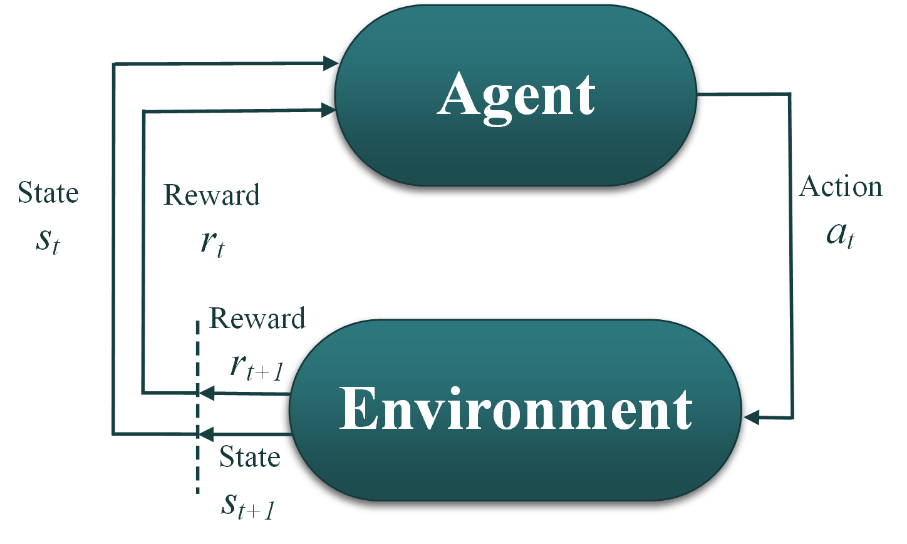

.. _hyperparameter:

=======================
Reinforcement Learning
=======================

Reinforcement learning (RL) is a paradigm of machine learning concerned with developing intelligent systems, that know how to take actions in an environment in order to maximize cumulative reward. RL does not need labelled input/output data as other machine learning algorithms. Instead, RL collects the data on-the-fly as needed to maximize the reward. This advantage makes RL a natural choice for optimisation problems, for which the search space is usually too complex and too high to generate a representative dataset.  

RL algorithms, like evolutionary algorithms, focus on finding a balance between exploration (new knowledge) and exploitation (of current knowledge) to maximize the fitness/reward function. We can take this analogy to make RL intuitive in solving optimisation problems through: 

	1- The agent: which is the optimizer. The agent is controlled by the RL algorithm that trains the agent to take proper actions. The algorithm takes the current state (:math:`s_t`) and the current reward (:math:`r_t`) as inputs, and decides the next action to take (:math:`a_t`) as output. The action :math:`a_t` in this case is a sample drawn from the parameter space for optimisation (:math:`\vec{x}=[x_1, x_2, ..., x_d]`).
	
	2- The current state (:math:`s_t`) for optimisation can be set equal to the current action (:math:`s_t \leftarrow a_t`), since we perturb the whole action space at once, and we are not marching through time. 
	
	3- The reward is similar as the fitness function in optimisation. If it is a minimization problem, the user can convert to reward maximization by multiplying the final fitness value with -1.
	
	4- The environment: takes the action provided by the agent (:math:`a_t`), evaluates that action using the fitness function, assigns the next state and the next reward for taking that action (:math:`s_{t+1}, r_t`), and sends them back to the RL agent. In NEORL, the user only needs to specify the reward/fitness function and the parameter space, and NEORL can automatically create the environment class. 
	
	5- Steps 1-4 are repeated for sufficient time steps until the agent learns how to take the right action based on the given state such that the reward is maximized. 
	
	6-The best action taken by the agent involves the optimised parameters (:math:`\vec{x}`), while the best reward is similar as the best fitness, :math:`y=f(\vec{x})`. 
   
Currently we have a support of some standalone deep RL algorithms, some are listed below

Deep Q Learning
=================

See the :ref:`DQN <dqn>` section

Proximal Policy Optimisation
=============================

See the :ref:`PPO <ppo2>` section

Advantage Actor Critic
=============================

See the :ref:`A2C <a2c>` section

..
	Original paper: Bergstra, J., & Bengio, Y. (2012). Random search for hyper-parameter optimization. Journal of machine learning research, 13(2).
	
	RL started with the classical Q-learning \cite{watkins1992q}, which relies on tables to store Q-value for every possible state-action pair in the problem, and then using that table to determine the action with maximum Q value to guide agent learning. In simple Q-learning, Q value is updated recursively, as derived from the Bellman equation  
	
	.. math::
	    Q^{new} (s_t, a_t) \xleftarrow{} (1-\alpha) \overbrace{Q (s_t, a_t)}^{\text{old value}} +  \underbrace{\alpha}_{\text{learning rate}} \overbrace{[\underbrace{r_t}_{\text{reward}} + \underbrace{\gamma}_{\text{discount factor}} \cdot \underbrace{\max \limits_a Q(s_{t+1}, a)}_{\text{optimum future value}}]}^{\text{learned value}},
	
	where :math:`s_t`, :math:`a_t`, and :math:`s_{t+1}` are the current state, current action, and next state, respectively. However, in most real-world applications, the state-action pairs can be extremely large, causing not only memory issues in storing them, but also large computational costs in interpreting these tables. Alternatively, neural networks are used to predict Q-value for each possible action based on previous observations by the agent, and then Q-learning can decide which action to take based on these predicted Q-values. Training deep neural networks to approximate the Q function is known as deep reinforcement learning \cite{mnih2015human}, or simply reinforcement learning (RL) for our work. However, a simple introduction of a neural network to approximate the Q function will be ineffective since the target network is continuously changing at every TS, causing training instabilities and overfitting. The work by \cite{mnih2015human} resolved this issue by using a concept of two parallel networks, one called primary Q network used for training, and another copy of it called target Q network used for prediction. The primary network is usually updated every TS (or after :math:`F_{train}`), while the target network is frozen and updated after a specific number of steps, controlled by the parameter :math:`C`, where :math:`C >> F_{train}`. The target model update involves simply copying the current weights of the primary network into the target network. The DQN objective function during training is to minimize the losses between the two network predictions as 
	
	.. math::
	
	   Loss= (\underbrace{r_k + \gamma \cdot \max \limits_{a'} Q(s_{k+1}, a';\bar{\theta})}_{\text{Target}} - \underbrace{Q(s_k, a_k; \theta)}_{\text{Predicted}})^2,
	
	where :math:`\bar{\theta}` and :math:`\theta` are used to distinguish between the weights of the target and primary networks, respectively, :math:`k` is the sample index in the replay memory, :math:`\gamma` is the discount factor (:math:`\sim`0.8-0.99), and :math:`r_k`, :math:`s_k`, :math:`a_k`, and :math:`s_{k+1}` are respectively the reward, current state, action to take, and next state associated with sample :math:`k` in the memory. Minimizing the losses can be done by training on gradient descent to find the best :math:`\theta` value. Hasselt et al. \cite{van2016deep} illustrated that vanilla DQN introduces systematic overestimation as the max operator uses the same Q values from the primary network to select and evaluate the action, causing overoptimistic performance. The solution is to use the primary network for action selection and the target network for action evaluation, where the loss in Eq.\eqref{eq:loss} can be redefined as 
	
	.. math::
	
	    Loss= (\underbrace{r_k + \gamma \cdot Q(s_{k+1}, \max \limits_{a'} Q(s_{k+1}, a';\theta); \bar{\theta)}}_{\text{Target}} - \underbrace{Q(s_k, a_k; \theta)}_{\text{Predicted}})^2,
	
	where now the target is changed as the action is determined by weights :math:`\theta`, but evaluated by weights :math:`\bar{\theta}`. The algorithm used in this work is given in Algorithm \ref{alg:dqn}. The algorithm starts by initializing a set of hyperparameters. First, :math:`\epsilon` balances the exploration vs exploitation dilemma in RL, and it represents the fraction of time the agent spent in exploring new knowledge (i.e., taking random actions), where :math:`\epsilon = 1` refers to a complete exploration, while :math:`\epsilon= 0` means the agent relies completely on its experience/memory in taking actions. We gradually reduce :math:`\epsilon` during training from :math:`\epsilon_{init}` to :math:`\epsilon_{end}`, where the training period at which :math:`\epsilon` is reduced is controlled by :math:`N_{anneal}`. After :math:`N_{anneal}` is passed, :math:`\epsilon` is fixed to :math:`\epsilon_{end}`. The replay memory :math:`D` is another feature of DQN, where past experiences are stored in a buffer during training. A mini-batch of size :math:`B` is used to estimate the losses in Eq.\eqref{eq:loss2}, by running gradient descent with learning rate :math:`lr`. The memory is initialized with some random transitions determined by :math:`N_{warmup} > 4B-5B`, where :math:`B` is the mini-batch size. The frequency of sampling transitions from the replay memory and updating the primary network is controlled by :math:`F_{train}`, where :math:`F_{train}=1` means that the primary network is updated every TS. Afterwards, three loops are executed, for epochs, episodes, and time steps, respectively. By the end of each epoch, the average reward is determined and used to indicate if the model is improved or not, if yes, the model is saved. 
	
	Two additional enhancements to DQN are highlighted briefly here since they are important for DQN performance even in their default settings: (1) dueling and (2) prioritized replay, the reader is referred to the following references for detailed information \cite{wang2015dueling,schaul2015prioritized}. The dueling architecture \cite{wang2015dueling} makes the agent able to evaluate a state without caring about the effect of each action from that state. Dueling is useful for cases where certain actions from a state do not affect the environment at all; these actions are not evaluated, giving the algorithm more speed. So far for DQN, experience transitions are uniformly sampled from the memory, replaying them in same frequency regardless of their significance. Prioritized replay aims for prioritizing experience by replaying important transitions (i.e., higher rewards) more frequently, therefore, learning more efficiently \cite{schaul2015prioritized}. Prioritized replay is controlled by two common exponents \cite{schaul2015prioritized}: :math:`\alpha` for proportional prioritization and :math:`\beta` for importance sampling correction, which is usually annealed from :math:`\beta_0 < 1` toward 1 by end of training. In this work, according to the literature suggestions for prioritized replay, we set :math:`\alpha = 0.6`, :math:`\beta_0 = 0.4`. 
	
	Proximal Policy Optimisation
	=============================
	
	See the :ref:`PPO <ppo2>` section
	
	Original paper: Schulman, John, et al. "Proximal policy optimization algorithms." arXiv preprint arXiv:1707.06347 (2017)..
	
	Proximal policy optimization (PPO) belongs to the policy gradient (PG) family. PG family has been developed to preserve simplicity in RL implementation and less hyperparameter sensitivity than the Q-learning family. PG aims to train a policy that directly maps states to appropriate actions without an explicit Q function, by optimizing the following loss function
	
	.. math::
	    L^{PG}(\theta) = E_t[log \ \pi_\theta(a_t|s_t)A_t],
	    
	where :math:`E_t` is the expectation over a batch of transitions, :math:`\pi` is the policy to be optimized which has weights :math:`\theta`. The policy :math:`\pi` predicts action :math:`a` given state :math:`s` at time step :math:`t`. The loss term to be optimized is embedded in :math:`A_t`, the advantage estimate, which is controlled by :math:`\gamma` (the discount factor) and :math:`\lambda` (the bias-variance tradeoff parameter), see \cite{schulman2015high} for more details. For a special case when :math:`\lambda=1`, :math:`A_t` can be written as \cite{schulman2015high}
	
	.. math::
	    A_t = \underbrace{\sum_{k=0}^\infty \gamma^k r_{t+k}}_\text{Discounted Reward} - \underbrace{V(s_t),}_\text{Baseline (or VF) Estimate of Discounted Reward}
	
	where :math:`r` is the reward function, :math:`\gamma` is the discount factor, and :math:`V` is the baseline or value function (VF) estimate of the discounted reward. The advantage function estimates how much better the action took based on the baseline expectation of what would normally happen in this state, or in other words, it quantifies whether the action the agent took is better than expected (:math:`A_t > 0`) or worse (:math:`A_t < 0`) than the baseline estimate. Another benefit of using the advantage estimate is that it helps inferring the change in :math:`VF` without the need to explicitly calculating the real :math:`VF` value. After vanilla PG, several enhancements have been conducted to improve PG for continuous monitoring and control, which we include here for brevity: deep deterministic policy gradient \cite{lillicrap2015continuous}, Trust-Region Policy Optimization \cite{schulman2015trust}, and finally reaching to PPO \cite{schulman2017proximal}. The PPO algorithm performs two major steps. In the first step, transitions (i.e., a sequence of states, rewards, and actions) are gathered based on several interactions of an initial (old) policy with the environment. The length of time during which transitions are collected before update is :math:`F_{train} = NT`, which is the multiplication of number of parallel actors (i.e., :math:`N` cores) times the time horizon of each actor, :math:`T` in TS. For fixed :math:`N` cores, :math:`F_{train}` or :math:`T` is tuned for better performance. In the second step, the policy is updated by optimizing the neural network model, i.e., also known as the ``surrogate''. Likewise DQN, the second step of PPO is the deep learning part, which involves running gradient descent over the surrogate objective (:math:`L^{PPO}`) with learning rate :math:`lr`, mini-batch of size :math:`B`, and for :math:`opt_{epochs}` epochs. Notice that :math:`opt_{epochs}` here is used to refer to the supervised learning epoch, which marks a complete forward and backward pass through a static dataset, in this case, a batch of transitions collected over a time horizon. This epoch definition is different than our definition of RL epoch in section \ref{sec:env}. By defining the probability ratio, :math:`r_t(\theta)=\frac{\pi_\theta(a_t|s_t)}{\pi_{\theta_{old}(a_t|s_t)}}`, where :math:`\theta_{old}` are the policy parameters before the update, the surrogate loss/objective function for the clipped PPO (i.e., :math:`L^{CLIP}`) can be written as \cite{schulman2017proximal} 
	
	.. math::
	
	    L^{CLIP}(\theta) = E_t[\min( \underbrace{r_t(\theta)A_t}_\text{Modified PG Objective}, \ \underbrace{\text{clip}(r_t(\theta), 1-CLIP, 1+CLIP)A_t)}_\text{Clipped Objective}],
	
	where :math:`CLIP` is the clip range. The first term in the :math:`min` function is the modified PG objective after including the trust-region \cite{schulman2015trust}, while the second term modifies the objective by clipping the probability ratio to remove the incentive for moving :math:`r_t` outside of the interval [1 - :math:`CLIP`, 1 + :math:`CLIP`]. Two final terms are added to PPO \cite{schulman2017proximal} to ensure more stable training. The two terms come from the fact that since we are using a neural network architecture that shares parameters between the policy and the value function (which is embedded in the advantage estimate :math:`A_t`), a loss function (:math:`L_t^{VF}`) should be used that combines the policy surrogate error and the value function (VF) error terms. This effect is controlled by :math:`VF_{coef}`. To augment this effect, an additional entropy term (:math:`S[\pi_\theta]`), acting as a regularizer is incorporated, which is controlled by :math:`ENT_{coef}`. The entropy term ensures sufficient exploration by preventing premature convergence of a ``single'' action probability to dominate the policy. By combining the three terms, the final PPO objective can be written as follows \cite{schulman2017proximal}
	
	.. math::
	
	    L^{PPO}(\theta)= E_t[\underbrace{L_t^{CLIP}(\theta)}_\text{Clipping Term} - \underbrace{VF_{coef} \cdot L_t^{VF}(\theta)}_\text{Value Function Loss} + \underbrace{ENT_{coef} \cdot S[\pi_\theta](s_t)].}_\text{Entropy Term}
	
Lastly, it is worth highlighting some major differences between DQN and PPO. During training, DQN updates the parameters/weights of the Q-function, which acts as a middleman to map states to actions, while PPO updates the policy :math:`\pi` directly, that maps states to actions without Q-function in between. In addition, DQN is observed as sample efficient due to the replay memory and the frequent training :math:`F_{train}^{DQN} << F_{train}^{PPO}`. Although PPO is observed as sample inefficient since it discards previous experiences after updating the surrogate every :math:`F_{train}` (i.e., no replay memory), this sacrifice allows simpler implementation and faster training, facilitates hyperparameter tuning, and eases parallel calculations. The PPO algorithm used in this work is shown in Algorithm \ref{alg:ppo}.