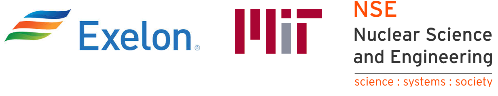

.. neorl documentation master file, created by Majdi I. Radaideh
   sphinx-quickstart on Thu Feb 25 19:34:47 2021.
   You can adapt this file completely to your liking, but it should at least
   contain the root `toctree` directive.

Welcome to NEORL Website!
=================================

*Latest News*: 

- November 24, 2021: Stable release 1.7 is out. 
- September 10, 2021: First NEORL stable release 1.6 is out. 

**Primary contact to report bugs/issues**: Majdi I. Radaideh (radaideh@mit.edu)

------------------------------------------------------------------------------------------------------------------------------

.. image:: images/logo.png
   :scale: 30 %
   :alt: alternate text
   :align: right
   
NEORL (**N**\ euro\ **E**\ volution **O**\ ptimisation with **R**\ einforcement **L**\ earning) is a set of implementations of hybrid algorithms combining neural networks and evolutionary computation based on a wide range of machine learning and evolutionary intelligence architectures. NEORL aims to solve large-scale optimisation problems relevant to operation & optimisation research, engineering, business, and other disciplines. 

Github repository: https://github.com/mradaideh/neorl

Copyright
--------------------------------------

   
This repository and its content are copyright of `Exelon Corporation <https://www.exeloncorp.com/>`_ © in collaboration with `MIT Nuclear Science and Engineering <https://web.mit.edu/nse/>`_  2021. All rights reserved.

You can read the first successful application of NEORL for nuclear fuel optimisation in this `News Article <https://news.mit.edu/2020/want-cheaper-nuclear-energy-turn-design-process-game-1217>`_.

User Guide
--------------------------------------

.. toctree::
   :maxdepth: 2
   
   guide/guide
   modules/modules
   tune/tune
   examples/examples
   
.. toctree::
   :maxdepth: 1
   
   misc/changelog
   misc/projects
   misc/contrib
   misc/contribguide

Projects/Papers Using NEORL
--------------------------------------

1- Radaideh, M. I., Wolverton, I., Joseph, J., Tusar, J. J., Otgonbaatar, U., Roy, N., Forget, B., Shirvan, K. (2021). Physics-informed reinforcement learning optimization of nuclear assembly design. *Nuclear Engineering and Design*, **372**, p. 110966 `[LINK1] <https://doi.org/10.1016/j.nucengdes.2020.110966>`_.  

2- Radaideh, M. I., Shirvan, K. (2021). Rule-based reinforcement learning methodology to inform evolutionary algorithms for constrained optimization of engineering applications. *Knowledge-Based Systems*, **217**, p. 106836 `[LINK2] <https://doi.org/10.1016/j.knosys.2021.106836>`_.

3- Radaideh, M. I., Forget, B., Shirvan, K. (2021). Large-scale design optimisation of boiling water reactor bundles with neuroevolution. Annals of Nuclear Energy, 160, 108355 `[LINK3] <https://doi.org/10.1016/j.anucene.2021.108355>`_.

Citing the Project
--------------------------------------

To cite this repository in publications:

.. code-block:: bibtex

	@misc{neorl,
	  author = {Radaideh, Majdi I. and Seurin, Paul and Wang, Haijia and Shirvan, Koroush},
	  title = {NEORL},
	  year = {2021},
	  publisher = {GitHub},
	  journal = {GitHub repository},
	  howpublished = {\url{https://github.com/mradaideh/neorl}},
	}

Acknowledgments
--------------------------------------

NEORL was established in MIT back to 2020 with feedback, validation, and usage of different colleagues: Issac Wolverton (MIT Quest for Intelligence), Joshua Joseph (MIT Quest for Intelligence), Benoit Forget (MIT Nuclear Science and Engineering), Ugi Otgonbaatar (Exelon Corporation).
