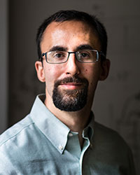
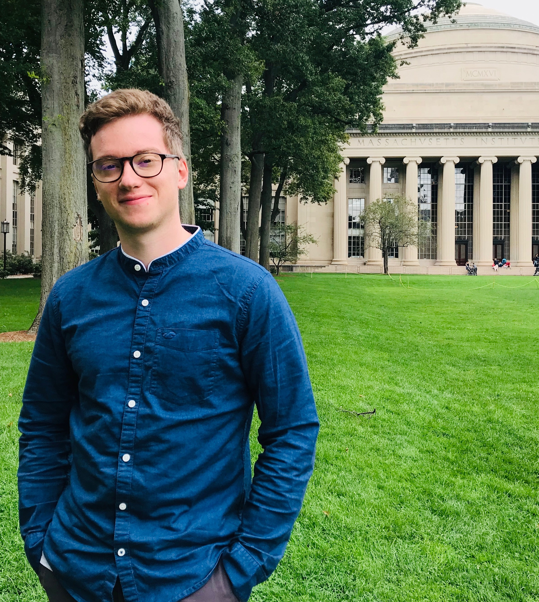
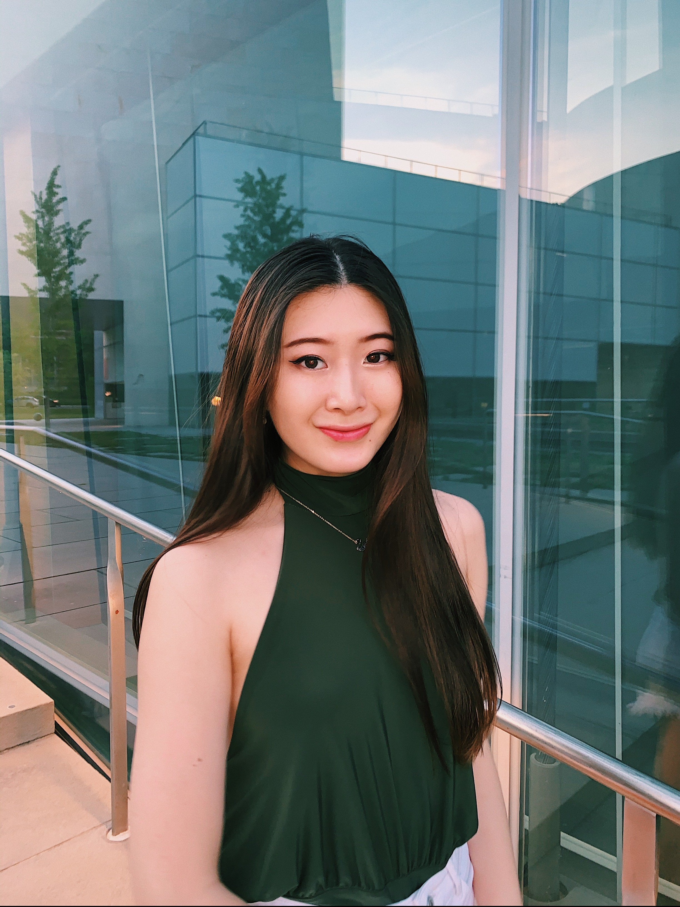
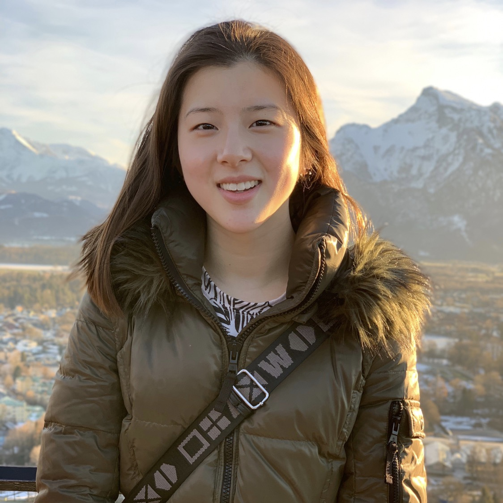

.. _contrib:

Contributors
================

.. image:: ../images/radaideh.jfif
   :scale: 45 %
   :alt: alternate text
   :align: right
   
Majdi I. Radaideh is a Postdoctoral Associate at MIT Nuclear Science and Engineering. He obtained his MS and PhD degrees from the University of Illinois at Urbana Champaign (UIUC) between August 2015 - August 2019. Radaideh's research focuses on algorithms, data engineering, deep learning, physics-informed machine learning, reinforcement learning, uncertainty quantification, and large-scale optimization with applications related to nuclear reactor safety and multiphysics simulations. Radaideh is the founder of NEORL with contributions include establishing the framework structure, algorithm development, open-source and documentation handling, benchmarking and testing, applications to nuclear fuel assembly optimisation, user interface handling, parallel computing, and many other minor contributions.

Github: https://github.com/mradaideh

   
Koroush Shirvan is the John Clark Hardwick (1986) Career Development Professor in the Department of Nuclear Science and Engineering. Previously, he was a principal research scientist at Center for Advanced Nuclear Energy Systems (CANES). He specializes in development and assessment of advanced nuclear reactor technology. His research combines multiple scales, physics and disciplines, and machine learning to realize innovative solutions in the highly regulated nuclear energy sector. His contribution to NEORL includes securing the funding for NEORL, significant contributions to the development of the physics-based applications of NEORL in the nuclear engineering area, and direct administration of the project. 

Webpage: https://web.mit.edu/nse/people/faculty/shirvan.html

Paul RM. Seurin is a Ph.D student in the joint program between the Nuclear Science and Engineering department and the Center for Computational Science and Engineering at MIT. He joined MIT in September 2019 after receiving an Engineering Diploma and a Master in Nuclear Engineering from France. His research involves algorithm design for optimization with focuses on heuristics methods, deep, and Reinforcement Learning with applications to nuclear reactor economics and licensing.  For NEORL, he is currently working on validation and benchmarking, applying the framework from Pressurized Water Reactor optimization to combinatorial and Mixed-Integer programming. 

   
Haijia Wang is an undergraduate student at MIT in the MIT Electrical Engineering and Computer Science Department. She is in the class of 2023, studying Computer Science and Engineering. She is passionate about algorithm design and optimization, artificial intelligence and machine learning, and advanced computing technologies. Haijia is interested in exploring these fields in her studies and future career. She worked as a summer research intern with NEORL in 2020, and her contribution was adding different hyperparameter tuning methods to NEORL, including evolutioanry search and Bayesian search. She also validated the classes for grid and random search.

Linkedin: https://www.linkedin.com/in/haijia-wang

Katelin Du is an undergraduate student at MIT in the class of 2023. She is studying nuclear science and engineering with a focus in computational modeling and simulation methods. She is interested in the use of computational tools such as simulation methods and machine learning in engineering applications. In the summer of 2021, she worked as an undergraduate researcher and contributed to NEORL by adding to its existing set of optimization algorithms and performing engineering benchmarking. Algorithms she worked on include Harris Hawks Optimization and hybrid neuroevolution Harris Hawks Optimization, and genetic algorithms.

 