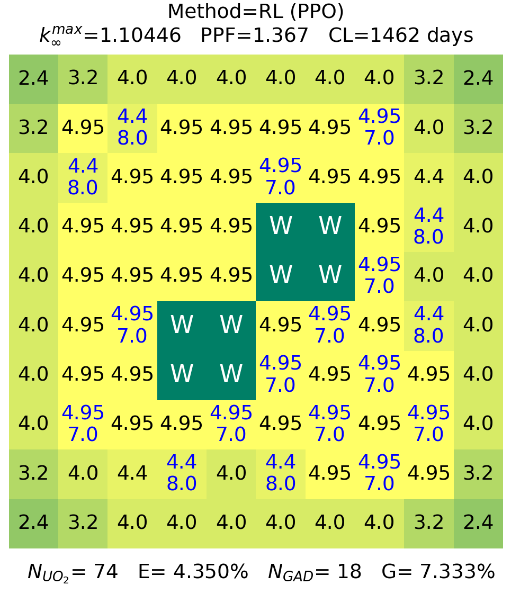
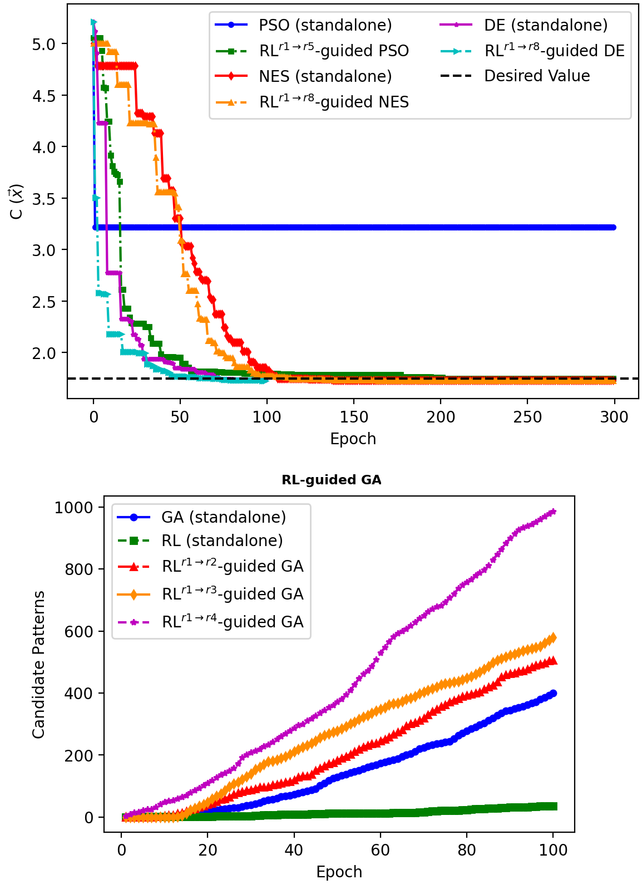

.. _projects:

Projects
=========

This is a list of projects using NEORL. Please contact us if you want your project to appear on this page.

Physics-informed Reinforcement Learning Optimisation with NEORL
------------------------------------------------------------------

   
Optimization of nuclear fuel assemblies if performed effectively, will lead to fuel efficiency improvement, cost reduction, and safety assurance. However, assembly optimization involves solving high-dimensional and computationally expensive combinatorial problems. As such, fuel designers’ expert judgement has commonly prevailed over the use of stochastic optimization (SO) algorithms such as genetic algorithms and simulated annealing. To improve the state-of-art, we explore a class of artificial intelligence (AI) algorithms, namely, reinforcement learning (RL) in this work. We propose a physics-informed AI optimization methodology by establishing a connection through reward shaping between RL and the tactics fuel designers follow in practice by moving fuel rods in the assembly to meet specific constraints and objectives. The methodology utilizes RL algorithms, deep Q learning and proximal policy optimization, and compares their performance to SO algorithms. The methodology is applied on two boiling water reactor assemblies of low-dimensional ( combinations) and high-dimensional ( combinations) natures. The results demonstrate that RL is more effective than SO in solving high dimensional problems, i.e., 10 × 10 assembly, through embedding expert knowledge in form of game rules and effectively exploring the search space. For a given computational resources and timeframe relevant to fuel designers, RL algorithms outperformed SO through finding more feasible patterns, 4–5 times more than SO, and through increasing search speed, as indicated by the RL outstanding computational efficiency. The results of this work clearly demonstrate RL effectiveness as another decision support tool for nuclear fuel assembly optimization.

| Authors: Majdi I. Radaideh et al., 2021.
| Reference: https://doi.org/10.1016/j.nucengdes.2020.110966

Reinforcement Learning Guiding Evolutionary Algorithms in Constrained Optimization
--------------------------------------------------------------------------------------

   
For practical engineering optimization problems, the design space is typically narrow, given all the real-world constraints. Reinforcement Learning (RL) has commonly been guided by stochastic algorithms to tune hyperparameters and leverage exploration. Conversely in this work, we propose a rule-based RL methodology to guide evolutionary algorithms (EA) in constrained optimization. First, RL proximal policy optimization agents are trained to master matching some of the problem rules/constraints, then RL is used to inject experiences to guide various evolutionary/stochastic algorithms such as genetic algorithms, simulated annealing, particle swarm optimization, differential evolution, and natural evolution strategies. Accordingly, we develop RL-guided EAs, which are benchmarked against their standalone counterparts. RL-guided EA in continuous optimization demonstrates significant improvement over standalone EA for two engineering benchmarks. The main problem analyzed is nuclear fuel assembly combinatorial optimization with high-dimensional and computationally expensive physics. The results demonstrate the ability of RL to efficiently learn the rules that nuclear fuel engineers follow to realize candidate solutions. Without these rules, the design space is large for RL/EA to find many candidates. With imposing the rule-based RL methodology, we found that RL-guided EA outperforms standalone algorithms by a wide margin, with  times improvement in exploration capabilities and computational efficiency. These insights imply that when facing a constrained problem with numerous local optima, RL can be useful in focusing the search space in the areas where expert knowledge has demonstrated merit, while evolutionary/stochastic algorithms utilize their exploratory features to improve the number of feasible solutions.

| Authors: Majdi I. Radaideh and Koroush Shirvan
| Reference: https://doi.org/10.1016/j.knosys.2021.106836

Application of GA and DQN for in-core fuel management
-----------------------------------------------------------------------------------------------
The nuclear reactor core is composed of few hundred assemblies. The loading of these assemblies is done with the goal of reducing its overall cost while maintaining safety limits. Typically, the core designers choose a unique position and fuel enrichment for each assembly through use of expert judgement. In this thesis, alternatives to the current core reload design process are explored. Genetic algorithm and deep Q-learning are applied in an attempt to reduce core design time and improve the final core layout. The reference core represents a 4-loop pressurized water reactor where fixed number of fuel enrichments and burnable poison distributions are assumed. The algorithms automatically shuffles the assembly positions to find the optimum loading pattern. It is determined that both algorithms are able to successfully start with a poorly performing core loading pattern and discover a well performing one, by the metrics of boron concentration, cycle exposure, enthalpy-rise factor, and pin power peaking. This shows potential for further applications of these algorithms for core design with a more expanded search space.

| Author: Jane Reed
| Reference: http://34.201.211.163/handle/1721.1/127308
