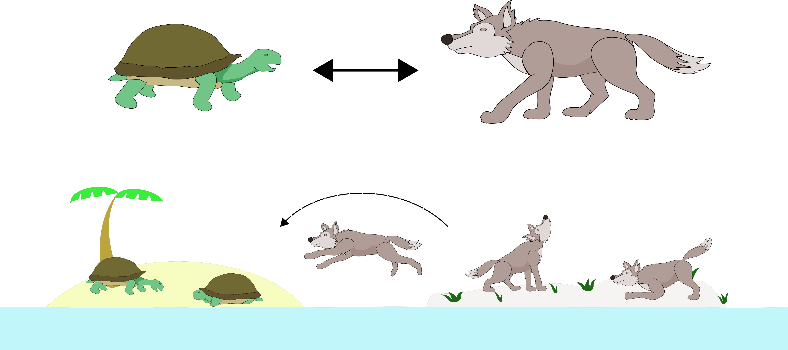

.. _aeo:

.. automodule:: neorl.evolu.aeo

Animorphic Ensemble Optimization (AEO)
===============================================

A module for Animorphic Ensemble Optimization

Original paper: in progress

What can you use?
--------------------

- Multi processing: ❌
- Discrete spaces: ❌
- Continuous spaces: ✔️
- Mixed Discrete/Continuous spaces: ❌

Parameters
----------

.. autoclass:: AEO
  :members:
  :inherited-members:

Example
-------

.. literalinclude :: ../scripts/ex_ts.py
   :language: python

Notes
-----

- Only valid in ``mode='min'``.
- AEO supports ``ES``, ``GWO``, ``WOA``, ``MFO``, ``SSA``, ``DE``, ``PSO`` and ``JAYA``.
- Algorithm objects must be defined prior to their inclusion in ``AEO`` (see example)
- Parameters such as ``F`` in ``DE`` or ``mu`` in ``ES`` are carried into ``AEO`` after initialization of these algorithms.
- Population size parameters such as ``nwolves`` in ``GWO`` are used to determine the starting populations but are changed as the algorithm progresses.
- ``fit``, ``bounds`` and ``mode`` should be consistent across algorithms passed into ``AEO``.
- The total number of function evaluation changes depending on the algorithms in the ensemble and the distributin of members.
- Information on the returned `log` can be found in the code for the ``AEO`` class.
