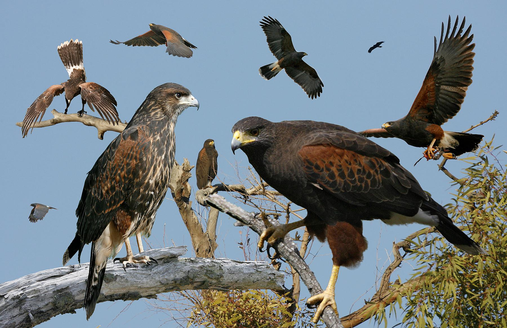

.. _hho:

.. automodule:: neorl.evolu.hho

Harris Hawks Optimization (HHO)
===============================================

A module for the Harris Hawks Optimization with parallel computing support and mixed discrete/continuous optimization ability. 

Original paper: Heidari, A. A., Mirjalili, S., Faris, H., Aljarah, I., Mafarja, M., & Chen, H. (2019). Harris hawks optimization: Algorithm and applications. Future generation computer systems, 97, 849-872.

What can you use?
--------------------

-  Multi processing: ✔️
-  Discrete spaces: ✔️
-  Continuous spaces: ✔️
-  Mixed Discrete/Continuous spaces: ✔️

Parameters
----------

.. autoclass:: HHO
  :members:
  :inherited-members:
  
Example
-------

.. literalinclude :: ../scripts/ex_hho.py
   :language: python

Notes
-----

- HHO  is inspired from the cooperative behavior and chasing style of Harris’ hawks in nature, which is called surprise pounce. Several hawks cooperatively pounce a prey from different directions in an attempt to surprise it.  The prey here can be a rabbit, which is a representative of the global optima.  
- HHO employs different exploration and exploitation strategies in form of soft and hard besieges as well as rapid dives before attacking the prey. These strategies are parameter-free, as only ``nhawks`` needs to be specified by the user. 
- We provide a flexible HHO implemetation that can handle continuous (``float``), discrete (``int``), and categorical (``grid``) and their mix. The user can control the type of discrete transformation via the argument ``int_transform``. 
- Therefore, if ``c1=None``, the user should notice that ``ngen`` value used within the ``.evolute`` function has an impact on the ``c1`` value and hence on SSA overall performance.
- ``ncores`` argument evaluates the fitness of all hawks in the swarm in parallel after the position update. Therefore, set ``ncores <= nhawks`` for most optimal resource allocation.
- Look for an optimal balance between ``nhawks`` and ``ngen``, it is recommended to minimize the number of ``nhawks`` to allow for more updates and more generations.
- Total number of cost evaluations for HHO is ``2*nhawks`` * ``ngen``.